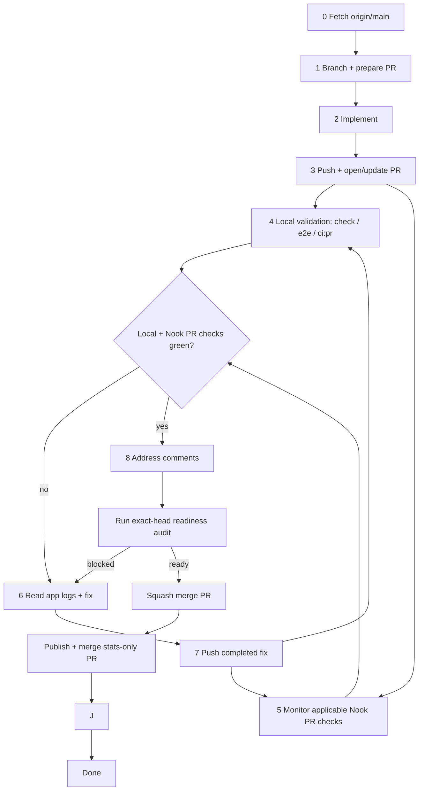

# Pull Request Workflow

Use this checklist for every change that lands on `main`. **AI agents must follow [coding-bro.md](coding-bro.md)** — the default implement-to-merge pipeline — and the detailed [agent pipeline](#agent-pipeline) below. Do not stop at push.

## PR-first agent contract

For implementation tasks, the agent's default job is not "make local edits"; it
is "land a locally validated PR with Nook's applicable PR test checks green." Start by
establishing the PR path, then keep ownership until merge or a concrete blocked
handoff:

1. **Prepare the PR path first** — fetch `origin/main`, create a feature branch,
   and define the PR title/body/scope before coding.
2. **Implement functionality** — make the requested code/docs/tests changes on
   the feature branch with focused local checks while iterating.
3. **Push and create/update the PR** — push a coherent commit and open the PR;
   later fixes update that same PR.
4. **Preflight and validate** — run `task pr:preflight PR=<number>` and inspect
   the path-applicable `PR / Verify and preview` and `Web research / Build and
   deploy research catalog` workflows while local validation runs.
5. **Fix Nook's failed PR workflow** — inspect failed logs, consult app logs for
   web/e2e failures, fix locally, and push the completed fix; the synchronize
   event re-evaluates the repository-owned check.
6. **Settle existing review feedback** — inspect current comments and reviews,
   reply to every actionable human or automated finding, and resolve each
   thread. Do not request or wait for optional reviewers.
7. **Merge automatically when ready** — after the branch is current with
   `origin/main`, Nook's applicable repository-owned PR test checks are green,
   all actionable comments are resolved, and `task pr:ready`
   succeeds, squash-merge immediately without requesting separate permission.

## ⛔ SQUASH MERGE ONLY

**Every PR merged into `main` MUST be squash-merged.**

| Allowed                         | Forbidden                                               |
| ------------------------------- | ------------------------------------------------------- |
| GitHub UI: **Squash and merge** | Create a merge commit                                   |
| CLI: `gh pr merge <n> --squash` | `gh pr merge --merge`                                   |
| One commit per PR on `main`     | `gh pr merge --rebase`                                  |
|                                 | Fast-forward that keeps branch commit history on `main` |

`main` must stay linear: **one squash commit per PR**. Feature branches can have many commits; that history is discarded at merge time.

If you merge a PR for the user, **confirm squash** before completing the merge. Merging any other way is a process violation.

## Agent pipeline

Named **coding bro** in [coding-bro.md](coding-bro.md). End-to-end flow for autonomous agents working on a task:



### 0. Fetch and branch

Fetch before branching so the feature branch starts from current `origin/main`:

```bash
git fetch origin main
git checkout -b <branch-name> origin/main
```

Never commit directly on `main`.

### 1. Prepare the PR path

Before editing, decide the branch name and PR scope/title/body. The PR may be
opened after the first coherent commit, but the work should already be organized
around getting that PR green and merged.

### 2. Implement

### 3. Push at the final-validation boundary

When the branch has a coherent implementation commit, commit and push/open or
update the PR **before** starting any required final local gate. This lets remote
CI and local Docker validation run in the same wall-clock window. Never run
`task check`, a full test suite, build, e2e, or post-fix final validation and only
then push; that serializes work and wastes the full local-check duration. This is
not a license to push half-finished work: use only focused development checks
while implementing, and push once the branch is coherent enough to validate.

```bash
git push -u origin HEAD
gh pr create --title "…" --body "…"
```

After the final push, inspect feedback already present and handle every
actionable finding. Do not request or wait for external reviewers. See
[code-review.md](code-review.md).

The feedback inspection and readiness audit replace any blind review-batching
grace period.

### 5. Local checks

**Remote PR CI is the primary validation pipeline.** `pr.yml` uses GitHub-hosted
`ubuntu-latest`, validates the exact pushed head, and restores main-seeded, lineage-specific
BuildKit caches through GitHub's cache service. Follow-up pushes may also reuse
the PR branch cache. Push each coherent ready change immediately so the
repository checks start or refresh before benchmarks, PR metadata work, or full
local validation. **Focused local Docker commands can use
cached images** and are strongly preferred for checking tests, fixing issues,
and iterating. Once the iteration is ready for final validation, push first and run
the local gate immediately while remote CI runs. Remote CI validates the PR in
the repository runner environment; local Docker remains the complementary
diagnostic loop. Concurrent PR and AI jobs scale across GitHub-hosted runners.

```text
implement/fix → commit → push/update PR → local required gate ‖ applicable PR workflows
```

**Minimum local final gate before merge or handoff:**

```bash
task format:check    # or task format after edits
task check           # format check, lint, coverage-gated tests, web build (Docker)
```

For scoped changes, faster subsets are acceptable when the touch surface is narrow:

```bash
task web:check && task web:test           # web-only
task rust:test                            # nook-core + nook-auth2 nextest only (no coverage gate)
task rust:coverage:check                  # nook-core + nook-auth2 tests + line coverage floor
```

**E2e debug — one spec at a time.** During a fix/debug session, run individual specs instead of the full suite:

```bash
E2E_SPEC=e2e/connect.spec.ts task web:test:e2e:file
```

**Full PR CI mirror** — run in the parallel local gate; **mandatory before merge/handoff** after any broad remote PR CI failure:

```bash
task ci:pr    # prepare → verify ‖ web build (no browser e2e)
```

After a remote failure, fix the root cause, push the completed fix, and run
`task ci:pr` locally while the refreshed remote run executes. This matches what
`pr.yml` runs (minus Cloudflare deploy).

| When                            | Command                                 | Why                                                        |
| ------------------------------- | --------------------------------------- | ---------------------------------------------------------- |
| While debugging e2e             | `E2E_SPEC=… task web:test:e2e:file`     | Fast feedback — one spec, not the full suite               |
| Extension/package iteration     | `task extension:check:fast`             | Host-cached extension security and build checks            |
| Final validation boundary       | `git push` / `gh pr create`            | Start remote CI before long local checks                   |
| Normal final local gate         | `task check` (+ scoped e2e when needed) | Cached local Docker; runs in parallel with remote CI       |
| Web/vault/sync changes          | `task web:test:e2e` or `task ci:pr:e2e` | Explicit full local-provider or web + extension e2e        |
| After broad remote CI failure   | `task ci:pr`                           | Full PR gates locally before merge/handoff                 |

See [ci-pipeline.md § Local vs remote CI](ci-pipeline.md#local-vs-remote-ci).

Workflow cancellation must follow the scopes in
[ci-pipeline.md § Workflow concurrency policy](ci-pipeline.md#workflow-concurrency-policy).
PR validation cancels only an older run for the same PR; unrelated PRs keep
independent required checks. Any cancellable live-provider job must also keep
its external-resource cleanup in a separate `if: always()` step so an
interrupted test process cannot leak provider state.

### 5.1. Local e2e (debug and final validation)

PR CI intentionally omits browser e2e; `main.yml` is the automatic full-suite gate after merge. Use a single spec while debugging, then run the full project or `task ci:pr:e2e` explicitly before merge for changes that touch:

- vault sync, join, or enrollment flows
- login / unlock / password envelope UI
- multi-step web flows or Playwright helpers

**While debugging — one spec at a time** (do not wait for the full suite):

```bash
E2E_SPEC=e2e/connect.spec.ts task web:test:e2e:file
```

**Final local e2e gate — full local-provider project or web + extension wrapper:**

```bash
task web:test:e2e          # full local-provider e2e project in Docker
# or include extension e2e as well:
task ci:pr:e2e
```

Skip e2e for small, isolated Rust-only or docs-only changes.

### 6. Monitor only Nook's applicable PR test checks until green

`pr.yml` runs native Rust on one hosted runner while `PR / Verify and preview` keeps WASM, web verification/build, and deployment on a second runner. Generated WASM stays on that runner instead of being uploaded to a third VM. After the web build, the job downloads the native runner's small coverage artifact for comparison/reporting, then deploys the internal harness plus isolated native Pages aliases for site, Simple, and Sentinel. The isolated site alias is recorded as the successful `github-pages` deployment for ruleset enforcement. The automatic full browser e2e gate runs on main only (`ci:main`).

**Do not stop after opening the PR.** Wait only for applicable repository-owned
workflows: `PR`, plus `Web research` when `.github/workflows/web-research.yml` or
`nook-app/nook-web/nook-web-research/**` changes. Never use an all-check watcher
that can remain blocked on external services. If neither repository workflow
applies to the changed paths, there is no remote check to wait for.

```bash
task pr:preflight PR=<number>
```

Use `task pr:ready PR=<number>` for a read-only exact-head readiness assertion.
The command never merges by itself. Its success is the final signal for the
task-owning agent to squash-merge immediately.

Do not request or wait for Codex, Claude, Cursor, CodeRabbit, or any other
optional external review/check. Repository-owned checks and exact-head
deployment remain required.

Before treating a PR as mergeable, **always verify the branch against the latest
`origin/main`**. Do this every time, even when all visible checks are green. If a
green PR cannot merge, assume the first and most likely blocker is that `main`
advanced and the PR branch is stale. GitHub may surface that stale-branch state
as an "Update branch" requirement, `mergeStateStatus: BLOCKED`, or a missing
active check because the green run belongs to an older base. Fetch `main`,
compare divergence, and update the PR branch before chasing other branch-policy
explanations:

```bash
git fetch origin main
git rev-list --left-right --count HEAD...origin/main
gh pr view <number> --json mergeStateStatus,baseRefOid,headRefOid,statusCheckRollup
```

If the branch is behind `origin/main`, merge the base branch into the PR branch,
push; the synchronize event re-evaluates Nook's workflows from the new head SHA.
Do not merge until this freshness check passes:

```bash
git merge origin/main --no-edit
git push origin HEAD
task pr:ready PR=<number>
```

### 6.1. Address review comments

Actionable PR feedback that already exists must be handled, whether it comes
from a human reviewer, Codex, or another automated reviewer. Follow
[code-review-comments.md](../dynamic-skills/code-review-comments.md) for the full
checklist.

Agents must leave their own GitHub reply explaining the fix, validation, or
no-change rationale before resolving any PR comment or review conversation. Do
not resolve comments silently. Inspect submitted review bodies as well as inline
review threads and PR comments:

```bash
gh pr view <pr-number> --comments
head_sha="$(gh pr view <pr-number> --json headRefOid --jq .headRefOid)"
gh api repos/meta-secret/nook/pulls/<pr-number>/reviews \
  --jq ".[] | {user: .user.login, state, body, html_url, commit_id, current_head: (.commit_id == \"$head_sha\")}"
```

Treat actionable submitted-review bodies as current only when `current_head` is
`true`. Keep older review bodies as audit context, and use thread `isOutdated`
state plus the current code when deciding whether an older inline finding still
needs a reply.

Use the GitHub review-thread GraphQL query from the
[code-review-comments skill](../dynamic-skills/code-review-comments.md) to
inspect unresolved inline conversations. Reply only on actual review
threads/comments that support targeted replies. Track actionable submitted
review-body items without a threaded reply target in the checklist/final handoff
rather than creating comment spam. Resolve all actionable threads and re-query
immediately before merge. Do not request or wait for optional external reviews
or status changes. See
[code-review.md](code-review.md).

### 7. Fix loop on failure

Investigation order: **test output** → **static analysis** → **app logs** (most
important after the first two). See
[logging.md § Debugging…](../references/logging.md#debugging-troubleshooting-and-ci-verification).

1. Read the failed job log: `gh run view <run-id> --log-failed`
2. For **e2e / web failures**, read persisted app logs before changing code:
   Playwright attachment `nook-app-logs.json`, local `fetchAppLogs(page)` /
   `/app-logs`, or `dumpNookLogs(page)`.
3. Fix the root cause.
4. Push the completed fix so Nook's PR workflow restarts.
5. **Run full local PR CI while Nook's PR workflow runs:** `task ci:pr` (not just `task check` — a broad remote failure may be in the production web build or another gate `check` skips). For a browser failure from main/nightly or a high-risk web change, also run the matching e2e spec/project.
6. Return to step 5 and wait for local validation and Nook's applicable PR
   checks. Never request or wait for external review services.

If the failure was obviously fmt/lint-only, `task format:check` + the relevant
lint/test subset can prove the fix. For broader failures, use `task ci:pr` as
the local gate on the latest pushed head before merge or handoff.

### 8. Merge and finish

When **Nook's applicable repository-owned PR test checks pass**, the branch is
current with `origin/main`, all actionable comments are resolved, and `task
pr:ready` succeeds:

```bash
gh pr merge <number> --squash
```

The successful squash merge completes implementation delivery. Do not wait for,
monitor, or live-verify the resulting Main run unless the user explicitly
requested deployment/live verification or assigned a Main failure.

After merge, `main.yml` independently runs full local-provider and extension
**e2e**. Main failures remain visible for manual handling and never start an AI
agent automatically. Nightly covers sync-live and retains its `ci-fix` worker,
which opens a repair PR; any task-owning agent that continues that PR follows
the same readiness-and-squash-merge contract.

### 9. Post-merge statistics and analysis

Every normal AI-agent-owned PR continues through a separate statistics commit
after merge. Follow [agent-statistics.md](agent-statistics.md): create
`.stats/ai-agent/<source-pr-number>.yaml`, include all local validation and
repository workflow executions/retriggers plus merge attempts and elapsed time,
record the repository test inventory (counts by type and absolute total) on the
merged head, compare with one or two recent comparable records, and assess waste.

Publish exactly that one YAML file in a stats-only PR and squash-merge it
immediately. Product checks, review, deployments, and `task pr:ready` are skipped
only for this verified one-file PR; the product pipelines ignore `.stats/**`.
Do not wait for post-merge Main before creating it, and do not include a Main
run merely because the implementation PR triggered one. The stats-only PR does
not generate another record. If the comparison identifies
actionable performance regression or workflow waste, create a separate normal
build-performance PR and take it through the full pipeline.

### 10. Task completion report

Every agent turn that **finishes a user-assigned task** must end with a short **completion report** that includes **how long the work took**.

**When to report:** After the task is done — merged implementation PR, delivered answer, or explicit handoff. Do not wait for a post-merge Main run unless deployment/live verification was explicitly requested. Do not omit this on multi-step work that spans monitor/fix/merge cycles; report once at the very end.

**What to measure:** Wall-clock time from when you **started working on the user's request** (first implementation step or investigation for that assignment) until you send the final message. Include CI wait time if you monitored checks as part of the task.

**Format** — add a `## Duration` line (or equivalent) in the final reply:

```markdown
## Duration

12m 34s (started 2026-06-28T20:15:00Z, finished 2026-06-28T20:27:34Z)
```

Rules:

- Use a human-readable duration (`Xm Ys`, or `Xh Ym` when over an hour).
- Include UTC ISO timestamps for start and finish when you can infer them; otherwise duration alone is acceptable.
- If the task was blocked waiting on the user, exclude idle wait time and note `active time: …` vs `elapsed: …`.
- For question-only turns with no implementation, a duration line is optional.

**Docker:** Never kill the Docker daemon — only stop containers (`docker stop`). See [rules.md §5](../rules.md#docker-daemon--never-kill-it).

## Standard flow (summary)

See [coding-bro.md](coding-bro.md) for the numbered 0–12 checklist.

1. Fetch `origin/main`; branch from it.
2. Implement and push/open/update the PR when the iteration is ready for final validation.
3. Run `task check` (or scoped subset) while Nook's applicable repository-owned PR workflows run.
4. Monitor the applicable repository checks; never request or wait for optional external reviews/checks.
5. Address and resolve every actionable comment already present.
6. On failure: fix → push completed fix → run the required local gate while CI refreshes.
7. **Squash merge** into `main` immediately after the exact-head readiness audit
   succeeds; green checks alone are insufficient.
8. Delete the branch (optional).
9. **Publish, analyze, and immediately merge** the one-file stats-only PR; open
   a separate normal performance PR when the evidence requires a fix.
10. **Report task duration** in the final message (see [§ Task completion report](#10-task-completion-report)).

## CLI reference

```bash
# Open PR
gh pr create --title "…" --body "…"

# Merge (ONLY this form)
gh pr merge <number> --squash
```

See also [rules.md §6](../rules.md#6-git--pull-request-workflow).
