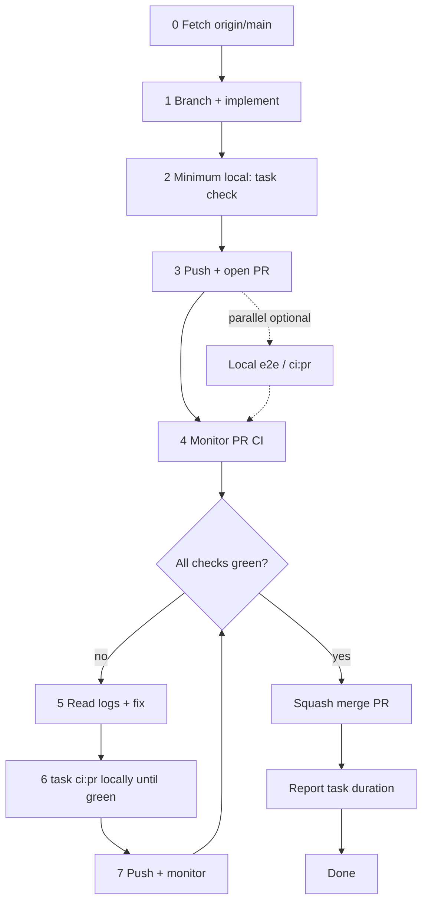

# Pull Request Workflow

Use this checklist for every change that lands on `main`. **AI agents must follow [coding-bro.md](coding-bro.md)** — the default implement-to-merge pipeline — and the detailed [agent pipeline](#agent-pipeline) below. Do not stop at push.

## ⛔ SQUASH MERGE ONLY

**Every PR merged into `main` MUST be squash-merged.**

| Allowed | Forbidden |
|--------|-----------|
| GitHub UI: **Squash and merge** | Create a merge commit |
| CLI: `gh pr merge <n> --squash` | `gh pr merge --merge` |
| One commit per PR on `main` | `gh pr merge --rebase` |
| | Fast-forward that keeps branch commit history on `main` |

`main` must stay linear: **one squash commit per PR**. Feature branches can have many commits; that history is discarded at merge time.

If you merge a PR for the user, **confirm squash** before completing the merge. Merging any other way is a process violation.

## Agent pipeline

Named **coding bro** in [coding-bro.md](coding-bro.md). End-to-end flow for autonomous agents working on a task:



### 0. Fetch and branch

Fetch before branching so the feature branch starts from current `origin/main`:

```bash
git fetch origin main
git checkout -b <branch-name> origin/main
```

Never commit directly on `main`.

### 1. Implement

### 2. Local checks

Remote PR CI takes **5+ minutes** plus queue time; full local `task ci:pr` is ~3–4 minutes. Default strategy: **minimum checks before the first push**, **full local PR mirror only after a remote failure**.

**Minimum before first push / opening a PR:**

```bash
task format:check    # or task format after edits
task check           # format check, lint, coverage-gated tests, web build (Docker)
```

For scoped changes, faster subsets are acceptable when the touch surface is narrow:

```bash
task web:check && task web:test           # web-only
task rust:test                            # nook-core nextest only (no coverage gate)
task rust:coverage:check                  # nook-core tests + line coverage floor
```

Do **not** block the first push on `task ci:pr` — let remote CI be the first full gate.

**Full PR CI mirror** — **mandatory after any remote CI failure**, before the next push:

```bash
task ci:pr    # prepare → verify ‖ web build → e2e-pr (~3–4 min)
```

Run `task ci:pr` in a loop: fix failures, re-run until green, then commit and push. This matches what `pr.yml` runs (`task ci:pr:publish` minus toolchain push and Cloudflare deploy). One remote failure is the signal to escalate locally instead of burning another 5+ minute remote cycle.

| When | Command | Why |
|------|---------|-----|
| First push / open PR | `task check` (or scoped subset) | Fast fmt, lint, unit tests, build — **must finish before push** |
| Same turn as push | `task web:test:e2e:pr` / `task ci:pr` | Optional; run **in parallel** with push/PR — do not block push |
| After **any** remote CI failure | `task ci:pr` until green | Full PR gates locally; **must finish before the fix push** |
| High-risk web change (optional) | `task ci:pr` before first push | Avoid remote failure on vault/sync/login flows |

See [ci-pipeline.md § Local vs remote CI](ci-pipeline.md#local-vs-remote-ci).

### 3. Local e2e (debugging after failure or high-risk changes)

PR CI runs **e2e-pr** (~1 min, IndexedDB specs). After a remote e2e failure, or optionally before the first push when the change touches:

- vault sync, join, or enrollment flows
- login / unlock / password envelope UI
- multi-step web flows or Playwright helpers

```bash
task web:test:e2e:pr       # fast e2e-pr project in Docker
# or, after task check already built wasm + dist:
task web:test:e2e:pr:parallel
```

Skip e2e-pr for small, isolated Rust-only or docs-only changes.

### 4. Push and open a PR

Push as soon as minimum local checks pass. Open the PR in the same turn — do not wait for local e2e or full `task ci:pr` unless you are fixing a prior CI failure.

```bash
git push -u origin HEAD
gh pr create --title "…" --body "…"
```

`pr.yml` runs `task ci:pr:publish`: prepare → verify ‖ web build → **e2e-pr** → toolchain push, then deploys a Cloudflare preview.

### 5. Monitor CI until green

**Do not stop after opening the PR.** Poll checks until every required job finishes:

```bash
gh pr checks <number> --watch          # blocks until done
# or poll manually:
gh pr view <number> --json statusCheckRollup -q '.statusCheckRollup[] | "\(.name): \(.state) \(.conclusion // "pending")"'
```

### 6. Fix loop on failure

1. Read the failed job log: `gh run view <run-id> --log-failed`
2. Fix the root cause.
3. **Run full local PR CI and repeat until green:** `task ci:pr` (not just `task check` — remote failure means the gap is likely e2e, web build, or a gate `check` skips).
4. Commit, push, return to step 5.

If the failure was obviously fmt/lint-only, `task format:check` + the relevant lint/test subset can unblock a quick fix — but **never push twice in a row** without escalating to `task ci:pr` after the first remote red build.

### 7. Merge and finish

When **all PR checks pass** and the user asked you to merge (or the task implies merge-on-green):

```bash
gh pr merge <number> --squash
```

After merge, `main.yml` runs full stub **e2e** Playwright. Nightly covers sync-live. The agent's job on the PR is complete once squash-merged.

### 8. Task completion report

Every agent turn that **finishes a user-assigned task** must end with a short **completion report** that includes **how long the work took**.

**When to report:** After the task is done — merged PR, delivered answer, or explicit handoff. Do not omit this on multi-step work that spans monitor/fix/merge cycles; report once at the very end.

**What to measure:** Wall-clock time from when you **started working on the user's request** (first implementation step or investigation for that assignment) until you send the final message. Include CI wait time if you monitored checks as part of the task.

**Format** — add a `## Duration` line (or equivalent) in the final reply:

```markdown
## Duration
12m 34s (started 2026-06-28T20:15:00Z, finished 2026-06-28T20:27:34Z)
```

Rules:

- Use a human-readable duration (`Xm Ys`, or `Xh Ym` when over an hour).
- Include UTC ISO timestamps for start and finish when you can infer them; otherwise duration alone is acceptable.
- If the task was blocked waiting on the user, exclude idle wait time and note `active time: …` vs `elapsed: …`.
- For question-only turns with no implementation, a duration line is optional.

**Docker:** Never kill the Docker daemon — only stop containers (`docker stop`). See [rules.md §5](../rules.md#docker-daemon--never-kill-it).

## Standard flow (summary)

See [coding-bro.md](coding-bro.md) for the numbered 0–9 checklist.

1. Fetch `origin/main`; branch from it.
2. Implement; run `task check` (or scoped subset) before the first push.
3. Push; open PR with summary and test plan.
4. Monitor CI until green.
5. On failure: fix → `task ci:pr` locally until green → push → monitor again.
6. **Squash merge** into `main` when every remote check is green.
7. Delete the branch (optional).
8. **Report task duration** in the final message (see [§ Task completion report](#8-task-completion-report)).

## CLI reference

```bash
# Open PR
gh pr create --title "…" --body "…"

# Merge (ONLY this form)
gh pr merge <number> --squash
```

See also [rules.md §6](../rules.md#6-git--pull-request-workflow).
