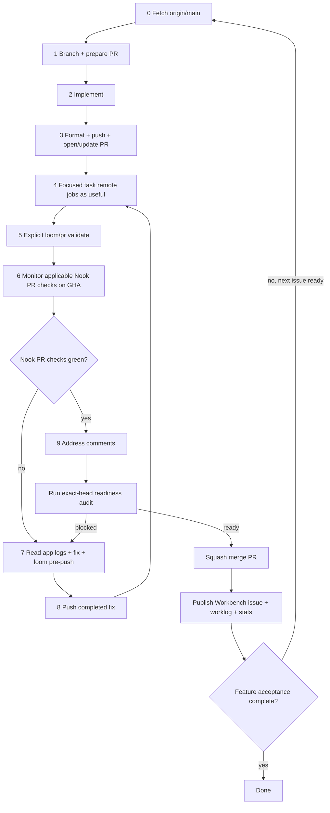

# Pull Request Workflow

## Relationships

- [Agent Feature Ownership](../dynamic-skills/agent-feature-ownership.md)
  - Defines the Agent Feature Ownership context used by this document.
  - Apply when implementation or delivery reaches this workflow boundary.
- [Code Review Comments](../dynamic-skills/code-review-comments.md)
  - Defines the Code Review Comments context used by this document.
  - Apply when implementation or delivery reaches this workflow boundary.
- [GitHub-Hosted Execution and Validation](../dynamic-skills/github-actions-only-validation.md)
  - Defines the boundary between local formatting and hosted validation.
  - Apply when implementation or delivery reaches this workflow boundary.
- [Pre-Push Hygiene](../dynamic-skills/pre-push-hygiene.md)
  - Defines formatting and UI-demo checks required before every push.
  - Apply when implementation or delivery reaches this workflow boundary.
- [Reference: Application Logging](../references/logging.md)
  - Defines application, test, and CI logging and troubleshooting evidence.
  - Consult when the task needs this operational reference.
- [Nook Coding Rules & Golden Principles](../rules.md)
  - Defines the repository-wide implementation, testing, tooling, and delivery constraints.
  - Apply throughout implementation and review.
- [AI Agent PR Statistics](agent-statistics.md)
  - Defines the post-merge agent statistics record and publication workflow.
  - Apply when implementation or delivery reaches this workflow boundary.
- [CI / GitHub Actions Pipeline](ci-pipeline.md)
  - Defines CI entry points, validation ownership, and hosted execution behavior.
  - Apply when implementation or delivery reaches this workflow boundary.
- [Review Request Workflow](code-review.md)
  - Defines the Review Request Workflow context used by this document.
  - Apply when implementation or delivery reaches this workflow boundary.
- [Coding Bro — Default Agent Workflow](coding-bro.md)
  - Defines the default end-to-end implementation and delivery workflow.
  - Apply when implementation or delivery reaches this workflow boundary.
- [Workbench Issue Management](issues.md)
  - Defines focused issue ownership and durable Workbench scope records.
  - Apply when implementation or delivery reaches this workflow boundary.
- [Main Build Statistics](main-build-statistics.md)
  - Defines the Main Build Statistics context used by this document.
  - Apply when implementation or delivery reaches this workflow boundary.
- [Quality and Release](quality.md)
  - Defines quality gates and the required response to check findings.
  - Apply when implementation or delivery reaches this workflow boundary.

## Document map

- [Overview](#overview)
  - Establishes the required path for every change that lands on `main`.
  - Read before preparing or delivering a pull request.
- [PR-first agent contract](#pr-first-agent-contract)
  - Makes the task owner responsible for the complete PR lifecycle.
  - Read before editing, validating, or handing off implementation work.
- [Pull request size and modularity](#pull-request-size-and-modularity)
  - Requires small, cohesive, ordered pull-request slices.
  - Read before estimating or expanding implementation scope.
  - [Size boundary](#size-boundary)
    - Caps authored pull-request additions and deletions at 5,000 lines.
    - Read when measuring or revising a proposed slice.
  - [Required plan](#required-plan)
    - Defines the size budget, module boundary, interfaces, and validation plan.
    - Read when publishing the task-start Workbench plan.
  - [Module-focused slices](#module-focused-slices)
    - Keeps each PR within one cohesive architectural responsibility.
    - Read when choosing slice boundaries or dependency order.
  - [Multi-PR feature delivery](#multi-pr-feature-delivery)
    - Requires a complete ordered Workbench sequence for large features.
    - Read when one safe PR cannot deliver the full requirement.
- [⛔ SQUASH MERGE ONLY](#-squash-merge-only)
  - Requires every pull request to land as one squash commit.
  - Apply at merge time.
- [Agent pipeline](#agent-pipeline)
  - Defines the exact implementation, validation, review, and merge pipeline.
  - Use while delivering a pull request.
  - [0. Fetch and branch](#0-fetch-and-branch)
    - Starts an owned feature branch from current `origin/main`.
    - Run before implementation edits and refresh before readiness.
  - [1. Prepare the PR path](#1-prepare-the-pr-path)
    - Publishes scope, ownership, and delivery context before editing.
    - Use at task start.
  - [2. Implement](#2-implement)
    - Implements the planned slice with required tests and documentation.
    - Use after the PR path and boundaries are established.
  - [3. Push an exact remote-executable commit](#3-push-an-exact-remote-executable-commit)
    - Formats, reviews, commits, and pushes one coherent revision.
    - Use before each hosted validation cycle.
  - [5. Hosted iteration and explicit validation](#5-hosted-iteration-and-explicit-validation)
    - Runs focused tasks and complete exact-head validation on hosted workers.
    - Use after every push that changes the PR head.
  - [5.1. Main-fix browser validation](#51-main-fix-browser-validation)
    - Requires dedicated hosted browser validation for fixes made directly from `main`.
    - Read when the changed path affects browser behavior without normal PR e2e.
  - [6. Monitor only Nook's applicable PR test checks until green](#6-monitor-only-nooks-applicable-pr-test-checks-until-green)
    - Defines which repository-owned checks must finish for the changed paths.
    - Read while monitoring validation and before readiness audit.
  - [6.1. Address review comments](#61-address-review-comments)
    - Requires every active human or automated review finding to be resolved.
    - Read whenever review feedback appears.
  - [7. Fix loop on failure](#7-fix-loop-on-failure)
    - Defines evidence-led diagnosis, correction, and exact-head revalidation.
    - Use after any hosted check fails.
  - [8. Merge and finish](#8-merge-and-finish)
    - Audits readiness, squash-merges, and verifies the resulting `main` commit.
    - Use only after checks and review are complete.
  - [9. Post-merge Workbench context and statistics](#9-post-merge-workbench-context-and-statistics)
    - Publishes issue updates, a worklog, and PR delivery statistics.
    - Use immediately after merge.
  - [10. Task completion report](#10-task-completion-report)
    - Defines the evidence and elapsed-time summary required at handoff.
    - Read before reporting task completion.
- [Standard flow (summary)](#standard-flow-summary)
  - Condenses the PR lifecycle into one routing sequence.
  - Read for orientation before using the detailed pipeline.
- [CLI reference](#cli-reference)
  - Provides canonical commands for branching, validation, review, and merge.
  - Use when executing a pipeline step from the shell.

## Overview

- Use this checklist for every change that lands on `main`.
- AI agents must follow [Coding bro](coding-bro.md) and the detailed
  [agent pipeline](#agent-pipeline) below.
  - Do not stop at push.
- Apply this workflow only to the current task's owned feature and focused
  issues.
- Treat another active task's branch and pull request as read-only.

Without an explicit handoff, do not:

- push to it;
- reply to its reviews;
- resolve its reviews;
- close or reopen it;
- change its labels;
- trigger its checks;
- merge it.

Full ownership policy:
[agent-feature-ownership.md](../dynamic-skills/agent-feature-ownership.md).

## PR-first agent contract

For implementation tasks, the agent's default job is not "make local edits".
It is "land a PR with Nook's applicable GitHub Actions PR test checks green."

Start by confirming feature ownership and establishing the PR path. Keep that
ownership until merge or a concrete blocked handoff:

1. **Prepare the PR path first:**
   - Fetch `origin/main`.
   - Estimate the authored changed lines.
   - Define the module boundary.
   - Split larger features into an ordered PR sequence.
   - Create the first feature branch.
   - Define the first PR's title, body, and scope.
2. **Implement functionality** — make the requested code/docs/tests changes on the feature branch. Focused build/test feedback runs on GitHub-hosted workers.
3. **Prepare a coherent commit:**
   - Run `task loom:pre-push`.
   - Commit the formatted change.
   - Run advisory local Codex review before the first owner-authored push.
   - For a harness-created PR, the continuing owner runs local review after
     handoff instead.
4. **Push and create or update the PR.**
5. **Request review and validate on GitHub Actions:**
   - Run focused `task remote TASK_NAME=<name>` jobs as useful.
   - Use focused hosted tasks while iterating.
   - When the coherent head is ready, run one complete-validation command:
     `task pr:validate PR=<number>` or
     `task loom:pr-land CONFIG=<pr-land-validate-request.yaml>`.
   - It dispatches checks and then requests exact-head Codex Cloud review.
   - Review-request failure does not block those checks.
   - Fix every actionable finding that arrives while checks run.
   - If no feedback exists when checks finish, continue without waiting.
   - Do not request or wait for other optional reviewers.
   - Inspect the path-applicable `PR / Verify and preview` and `Web research / Build and deploy research catalog` workflows.
   - Do **not** run a required local `task check` / `task ci:pr`.
6. **Fix Nook's failed PR workflow.** Inspect CI and app logs. Fix the
   failure, run pre-push hygiene, and push the complete fix. Request review and
   validate the replacement head together.
7. **Merge automatically when ready.** Require a current branch, green
   repository-owned checks, resolved actionable comments, and the exact-head
   readiness audit. Then squash-merge without separate permission.

## Pull request size and modularity

### Size boundary

- An implementation pull request targets no more than **5,000 authored changed
  lines**.
- Treat this as a planning ceiling because review, validation, conflict
  resolution, and repair costs rise sharply above it.
- Estimate before implementation.
- Re-estimate when design changes or the diff grows unexpectedly.

Count additions and deletions against the intended base for:

- authored source;
- tests;
- documentation;
- configuration;
- scripts and workflow code.

- During implementation, use `git diff --numstat <base>` for tracked
  working-tree changes.
- Count untracked authored files separately.
- After commit, use `git diff --numstat <base>...HEAD`.

Report these separately because they do not represent authored functionality:

- generated files;
- lockfiles;
- snapshots;
- vendored sources;
- binary artifacts;
- pure renames with no content change.

- Do not exclude tests or delete-heavy refactors from the authored estimate.
- Do not pad, compress, or mechanically reorganize code to fit the number.
- When the estimate approaches the ceiling, reduce scope before implementation.
- When implementation crosses the ceiling:
  1. stop expanding the PR;
  2. remove or defer enough authored changes to return to 5,000 lines or fewer;
  3. preserve one coherent bounded portion; and
  4. record a superseding plan for every deferred deliverable.

### Required plan

The Workbench task plan must state:

- the estimated authored changed lines;
- the files, packages, modules, or layers expected to change;
- the public or cross-module interfaces involved;
- whether one PR can deliver the complete feature;
- the current PR slice and its authored changed-line estimate;
- the ordered PR slices when more than one PR is needed;
- the acceptance evidence for each slice;
- a superseding immutable plan when scope or the estimate materially changes.

An estimate is a design tool.

It is not a promise of exact line count.

### Module-focused slices

Prefer one cohesive module, package, layer, or architectural responsibility per
pull request.

Apply SOLID principles as concrete review questions:

- Does the slice have one clear reason to change?
- Does new behavior extend a focused abstraction instead of adding conditionals
  across unrelated modules?
- Can a narrower interface replace a broad dependency?
- Do higher-level policies depend on stable abstractions?
- Are internal details hidden behind the owning module?

- Public interfaces should change less often than internal implementations.
- Design the narrow boundary before dependent slices begin.
- Do not expose speculative APIs without a planned consumer.

Each slice must be:

- coherent on its own;
- safe to merge;
- covered at the owning boundary;
- compatible with the previous merged slice;
- small enough for focused review and repair.

- A slice may prepare an interface or migrate one module before the complete
  user flow exists.
  - Its acceptance criteria must still be independently observable.

### Multi-PR feature delivery

- A feature may require many issues and pull requests.
- Use one Workbench feature summary for the full outcome.
- Create one focused issue for each independently mergeable slice.
- Record dependencies and order in the feature index.

Then repeat this loop:

1. Implement the first ready issue.
2. Validate and squash-merge its pull request.
3. Update the feature and issue records.
4. Fetch current `origin/main`.
5. Start the next ready issue on a new branch.
6. Continue until the feature acceptance criteria are complete.

- Remaining slices are required delivery work.
  - Do not label them optional because the first pull request merged.
- Do not keep one long-lived branch for the full sequence.

See [issues.md](issues.md#multi-pr-feature-sequences) for Workbench ownership.

## ⛔ SQUASH MERGE ONLY

**Every PR merged into `main` MUST be squash-merged.**

| Allowed                         | Forbidden                                               |
| ------------------------------- | ------------------------------------------------------- |
| GitHub UI: **Squash and merge** | Create a merge commit                                   |
| CLI: `gh pr merge <n> --squash` | `gh pr merge --merge`                                   |
| One commit per PR on `main`     | `gh pr merge --rebase`                                  |
|                                 | Fast-forward that keeps branch commit history on `main` |

`main` must stay linear: **one squash commit per PR**. Feature branches can have many commits; that history is discarded at merge time.

If you merge a PR for the user, **confirm squash** before completing the merge. Merging any other way is a process violation.

## Agent pipeline

Named **coding bro** in [coding-bro.md](coding-bro.md). End-to-end flow for autonomous agents working on a task:


```mermaid
flowchart TD
  Z[0 Fetch origin/main] --> A[1 Branch + prepare PR]
  A --> I[2 Implement]
  I --> E[3 Format + push + open/update PR]
  E --> X[4 Focused task remote jobs as useful]
  X --> V[5 Explicit loom/pr validate]
  V --> F[6 Monitor applicable Nook PR checks on GHA]
  F --> G{Nook PR checks green?}
  G -->|no| H[7 Read app logs + fix + loom pre-push]
  H --> PUSH[8 Push completed fix]
  PUSH --> X
  G -->|yes| C[9 Address comments]
  C --> R[Run exact-head readiness audit]
  R -->|blocked| H
  R -->|ready| M[Squash merge PR]
  M --> S[Publish Workbench issue + worklog + stats]
  S --> J{Feature acceptance complete?}
  J -->|no, next issue ready| Z
  J -->|yes| K[Done]
```

### 0. Fetch and branch

Fetch before branching so the feature branch starts from current `origin/main`:

```bash
git fetch origin main
git checkout -b <branch-name> origin/main
```

Never commit directly on `main`.

### 1. Prepare the PR path

1. Complete the size and modularity plan above.
2. Decide the branch name and the first PR's scope, title, and body.
3. Organize work around getting that slice green and merged.
4. Open the PR after the first coherent commit when useful.

### 2. Implement

Implement only the bounded slice described by the task plan and preserve its
owning interfaces and acceptance evidence.

### 3. Push an exact remote-executable commit

Prepare an exact remote commit:

1. Make the implementation coherent.
2. Run pre-push hygiene.
3. Commit and run advisory local review.
4. Push and open or update the PR.

This exposes the source to focused hosted tasks but does not start complete
validation.

- Never require `task check`, a full test suite, build, e2e, or post-fix
  product validation as a local gate.
- Always run `task loom:pre-push` before push.
- Push only when the branch is coherent enough to validate.

```bash
task loom:pre-push
git commit
task pr:review-local
git push -u origin HEAD
gh pr create --title "…" --body "…"
```

See [pre-push-hygiene.md](../dynamic-skills/pre-push-hygiene.md).

- Before the first owner-authored push, run `task pr:review-local` on the
  coherent head.
  - For a harness-created PR, run it immediately after handoff.
- After each coherent push, inspect feedback already present.
- Use focused remote tasks when they shorten diagnosis.
- Trigger complete validation only when the head is ready for the final gate.
  - It dispatches checks immediately and requests exact-head Codex review.
- After a complete-gate failure, validate the completed replacement head again.
- Do not wait for Codex or request other external reviewers.
  - See [Code review](code-review.md).

The feedback inspection and readiness audit replace any blind review-batching grace period.

### 5. Hosted iteration and explicit validation

**GitHub-hosted execution is the normal build/test path.** `remote.yml` runs allowlisted focused tasks repeatedly against an exact pushed branch head. `pr.yml` is the sole merge-validation pipeline and runs only when an agent explicitly applies a validation label through `task pr:validate`.

```text
implement/fix → task loom:pre-push → commit → local review → push/update PR
→ complete exact-head PR workflow and Cloud review request
```

**Required local action** (before every push):

```bash
task loom:pre-push
```

Always run `task loom:pre-push` again before every fix re-push.

Focused hosted commands (never merge gates):

```bash
task remote TASK_NAMES=web:check,web:test
task remote TASK_NAMES=rust:test,rust:coverage
```

Complete validation:

```bash
task pr:validate PR=<number>
# Main-fix PR:
task pr:validate PR=<number> FULL_E2E=1
```

| When                       | Command                                          | Why                                             |
| -------------------------- | ------------------------------------------------ | ----------------------------------------------- |
| Before every push          | `task loom:pre-push`                             | Only required local product action              |
| UI-facing path changes     | included in Loom pre-push                        | Cheap hygiene before hosted execution           |
| Focused build/test feedback| `task remote TASK_NAMES=<a>,<b>`                | Reuse one hosted worker for selected tasks      |
| Final validation boundary  | `task loom:pr-land CONFIG=<pr-land-validate-request.yaml>`     | Start the complete exact-head PR gate           |
| After complete CI failure  | fix → Loom pre-push → commit → push → validate again | A push does not refresh `pr.yml`              |

See [ci-pipeline.md § Local vs remote CI](ci-pipeline.md#local-vs-remote-ci) and [github-actions-only-validation.md](../dynamic-skills/github-actions-only-validation.md).

- Follow [workflow concurrency policy](ci-pipeline.md#workflow-concurrency-policy)
  for cancellation.
- Explicit validation cancels only an older labeled run for the same PR.
  - Unrelated PRs keep independent required checks.
- Every cancellable live-provider job keeps external-resource cleanup in a
  separate `if: always()` step.
  - An interrupted test must not leak provider state.

### 5.1. Main-fix browser validation

Normal PR CI omits browser e2e. A PR fixing a failure observed on `main` must trigger the `ci:full-e2e` validation path, which runs the Main-equivalent local-provider and extension browser suites before merge:

```bash
task pr:validate PR=<number> FULL_E2E=1
```

Agents do not run full e2e locally. Use the remote catalog for focused browser feedback and the explicit Main-fix gate for merge validation.

### 6. Monitor only Nook's applicable PR test checks until green

`pr.yml` runs native Rust and WASM on independent hosted runners.

**Producer and consumer split:**

- After clippy/build, the WASM producer uploads only the small generated package.
- Parallel browser-free preview validation can begin while required Node tests continue.
- Preview deployment remains blocked until the producer succeeds.
- Optional browser-e2e consumers wait for that fully verified producer.
- No consumer recompiles Rust.

**Preview and coverage:**

- Preview deploys the internal harness plus isolated native Pages aliases for site, Simple, and Sentinel without waiting for native coverage.
- A separate native-dependent coverage job downloads the current run's Rust artifact directly.
- When a base comparison is required, it resolves an exact-commit trusted Main artifact.
- It never cold-builds the base revision.
- The isolated site alias is recorded as the successful `github-pages` deployment for ruleset enforcement.

**Main-fix browser jobs:**

- PRs labeled `ci:full-e2e` additionally run independent web and extension jobs on separate hosted runners.
- Each builds the Chromium image from verified WASM.
- The overall `PR` workflow cannot succeed until both jobs succeed.

**Do not stop after opening the PR.** Wait only for applicable repository-owned workflows:

- `PR`
- `Web research` when `.github/workflows/web-research.yml` or `nook-app/nook-web/nook-web-research/**` changes

- Never use an all-check watcher that can remain blocked on external services.
- If neither repository workflow applies to the changed paths, there is no
  remote check to wait for.

```bash
task pr:preflight PR=<number>
```

- Use `task loom:pr-land CONFIG=<pr-land-ready-request.yaml>` or
  `task pr:ready` for read-only exact-head readiness.
  - The command never merges by itself.
  - Success tells the task owner to squash-merge immediately.
- Codex review is not a readiness requirement.
  - Do not wait for it after repository checks finish.
  - Do not request or wait for optional external reviews or checks.
- Repository-owned checks and exact-head deployment remain required when
  applicable.
- Before merge, always verify the branch against latest `origin/main` even when
  all visible checks are green.
- If a green PR cannot merge, first suspect a stale branch after `main`
  advanced.

GitHub may surface that stale-branch state as:

- an "Update branch" requirement
- `mergeStateStatus: BLOCKED`
- a missing active check because the green run belongs to an older base

Before chasing other branch-policy explanations:

1. Fetch `main`.
2. Compare divergence.
3. Update the PR branch when stale.

```bash
git fetch origin main
git rev-list --left-right --count HEAD...origin/main
gh pr view <number> --json mergeStateStatus,baseRefOid,headRefOid,statusCheckRollup
```

If the branch is behind `origin/main`:

1. Merge the base branch into the PR branch.
2. Push the new head.
3. Explicitly validate applicable workflows.
4. Do not merge until freshness passes.

```bash
git merge origin/main --no-edit
git push origin HEAD
task pr:validate PR=<number>
task pr:ready PR=<number>
```

### 6.1. Address review comments

- Handle all actionable feedback already present, regardless of author.
  - Follow [Code review comments](../dynamic-skills/code-review-comments.md).
- Before resolving a conversation, leave an agent-authored reply with the fix,
  validation, or no-change rationale.
  - Do not resolve silently.
- Inspect submitted review bodies, inline threads, and PR comments:

```bash
gh pr view <pr-number> --comments
head_sha="$(gh pr view <pr-number> --json headRefOid --jq .headRefOid)"
gh api repos/meta-secret/nook/pulls/<pr-number>/reviews \
  --jq ".[] | {user: .user.login, state, body, html_url, commit_id, current_head: (.commit_id == \"$head_sha\")}"
```

- Treat a submitted-review body as current only when `current_head` is `true`.
- Keep older bodies as audit context.
  - Use `isOutdated` and current code to decide whether an older inline finding
    still needs a reply.
- Use the review-thread GraphQL query from the review-comments skill to inspect
  unresolved inline conversations.
- Reply only where a real thread or comment supports a targeted reply.
- Track unthreaded submitted-review items in the checklist and handoff instead
  of creating comment spam.
- Resolve all actionable threads and re-query immediately before merge.
- Do not wait for Codex after repository checks finish or request optional
  external status changes.
  - See [Code review](code-review.md).

### 7. Fix loop on failure

Investigation order: **test output** → **static analysis** → **app logs** (most important after the first two). See [logging.md § Debugging…](../references/logging.md#debugging-troubleshooting-and-ci-verification).

Static analysis includes Knip unused findings and jscpd clone/duplicate findings. Fix those problems in code; do not silence the gate. See [quality.md § Fix check findings](../workflows/quality.md#fix-check-findings--not-silence-them).

1. Read the failed job log: `gh run view <run-id> --log-failed`
2. For **e2e / web failures**, read persisted app logs before changing code: Playwright attachment `nook-app-logs.json`, local `fetchAppLogs(page)` / `/app-logs`, or `dumpNookLogs(page)`.
3. Fix the root cause.
4. Run `task loom:pre-push`, commit, and push the completed fix.
5. Run Loom/Task validate and return to monitoring Nook's complete exact-head PR checks. Use a focused `task remote` job only when it shortens diagnosis.
6. Complete validation requests Codex review for the replacement head. Never
   wait for its result after checks finish or request other review services.

If the failure was obviously fmt-only, `task loom:pre-push` before re-push is enough. Broader failures are proven by the refreshed remote `pr.yml` run on the latest head.

### 8. Merge and finish

When **Nook's applicable repository-owned PR test checks pass**, the branch is current with `origin/main`, all actionable comments are resolved, and `task loom:pr-land CONFIG=<pr-land-ready-request.yaml>` / `task pr:ready` succeeds:

```bash
gh pr merge <number> --squash
```

The successful squash merge completes implementation delivery. Do not wait for, monitor, or live-verify the resulting Main run unless the user explicitly requested deployment/live verification or assigned a Main failure.

After merge, `main.yml` independently runs full local-provider and extension **e2e**.

**Main failure incidents (Hive):**

- Every actionable unsuccessful Main run creates one `automation: hive` Workbench incident keyed by failed SHA.
- This includes `Web e2e`, `UI demos`, and `Extension e2e`.
- Each run attempt creates a run-and-attempt-keyed delivery generation whose plan/worklog are generation-specific.
- A later failed rerun supersedes and cancels an active delivery before the new generation is enqueued.
- The dispatcher retries only after a poll interval longer than the worker heartbeat.
- The durable barrier is the worker's Neo4j acknowledgement that the stale Codex execution stopped.
- The old generation remains `CANCELLING` until worker acknowledgement or confirmed deletion of its recorded Kubernetes Pod, including cancelling exclusive blockers.
- Reconciliation of the current generation is idempotent.
- Successful reruns retire existing incidents and stop active delivery.
- The isolated Hive dispatcher enqueues actionable incidents once.
- One logical task owns diagnosis, a normal exact-head PR, actionable review resolution, squash merge, and verification of the resulting Main run.
- The scheduled `agent-implement.yml` worker does not claim Hive incidents.
- Credentialed sync-live checks are available only through explicit manual validation.

### 9. Post-merge Workbench context and statistics

Every normal AI-agent-owned PR continues through a Workbench publication after merge. Follow [issues.md](issues.md) and [agent-statistics.md](agent-statistics.md):

- Update the associated issue.
- Add the agent worklog.
- Create `stats/ai-agent/<source-pr-number>.yaml`.
- Include all local validation and repository workflow executions/retriggers plus merge attempts and elapsed time.
- Record the repository test inventory on the merged head.
- Compare with recent comparable records and assess waste.

Publish these records directly to `meta-secret/nook-workbench` `main`.

Do not:

- create a bookkeeping Nook branch or PR
- wait for post-merge Main
- include a Main run merely because the implementation PR triggered one

If the comparison identifies actionable performance regression or workflow waste, create a separate normal Nook build-performance PR and take it through the full pipeline.

Completed Main attempts independently commit one automated `stats/main-build/<run-id>-attempt-<attempt>.yaml` record to Workbench after the workflow finishes. Because no Nook ref changes, publication cannot recurse. See [main-build-statistics.md](main-build-statistics.md).

### 10. Task completion report

- Every turn that finishes a user-assigned task ends with a short completion
  report that includes duration.
- **When:** after merged delivery, delivered answer, or explicit handoff.
  - Do not wait for post-merge Main unless live verification was requested.
  - For a multi-step monitor/fix/merge cycle, report once at the end.
- **Measurement:** wall-clock time from first implementation or investigation
  through the final message.
  - Include CI wait time that the agent monitored.

**Format** — add a `## Duration` line (or equivalent) in the final reply:

```markdown
## Duration

12m 34s (started 2026-06-28T20:15:00Z, finished 2026-06-28T20:27:34Z)
```

Rules:

- Use a human-readable duration (`Xm Ys`, or `Xh Ym` when over an hour).
- Include UTC ISO timestamps for start and finish when you can infer them; otherwise duration alone is acceptable.
- If the task was blocked waiting on the user, exclude idle wait time and note `active time: …` vs `elapsed: …`.
- For question-only turns with no implementation, a duration line is optional.

**Docker:** Never kill the Docker daemon — only stop containers (`docker stop`). See [rules.md §5](../rules.md#docker-daemon--never-kill-it).

## Standard flow (summary)

See [coding-bro.md](coding-bro.md) for the numbered 0–12 checklist.

1. Fetch `origin/main` and branch from it.
2. Implement the focused change.
3. Run `task loom:pre-push`.
4. Commit the formatted change.
5. Run `task pr:review-local` before the first owner-authored push.
6. For a harness-created PR, run local review after handoff instead.
7. Push and open or update the PR.
8. Use focused `task remote` jobs only for faster isolated diagnosis.
9. Run Loom or Task validation on the ready head.
10. It dispatches checks and then requests exact-head Codex review.
11. Do not wait for review after checks finish or request optional reviews.
12. Address and resolve actionable comments.
13. On failure, fix the issue and repeat pre-push hygiene.
14. Push the fix and explicitly validate the replacement head.
15. Squash-merge after the exact-head readiness audit succeeds.
16. Publish the Workbench completion records.
17. Report task duration.

## CLI reference

```bash
# Open PR
gh pr create --title "…" --body "…"

# Merge (ONLY this form)
gh pr merge <number> --squash
```

See also [rules.md §6](../rules.md#6-git--pull-request-workflow).
