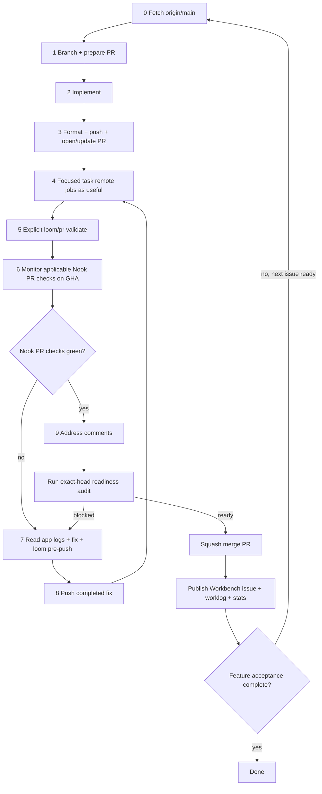

# Pull Request Workflow

## Overview

- Use this checklist for every change that lands on `main`.
- AI agents must follow [Coding bro](coding-bro.md) and the detailed
  [agent pipeline](#agent-pipeline) below.
  - Do not stop at push.
- Apply this workflow only to the current task's owned feature and focused
  issues.
- Another active task's branch and pull request are read-only without an explicit
  handoff.

Without an explicit handoff, do not:

- push to it;
- reply to its reviews;
- resolve its reviews;
- close or reopen it;
- change its labels;
- trigger its checks;
- merge it.

Full ownership policy:
[agent-feature-ownership.md](../dynamic-skills/agent-feature-ownership.md).

## PR-first agent contract

For implementation tasks, the agent's default job is not "make local edits".
It is "land a PR with Nook's applicable GitHub Actions PR test checks green."

Before establishing a PR path, apply the
[major architectural initiative rule](../dynamic-skills/self-improvement.md#user-authority-for-major-architectural-initiatives).
Stop at analysis and proposals when a major direction comes from agent
reasoning rather than an explicit user-selected implementation request.
Lifecycle records and an agent-authored plan do not grant that authority.

Start by confirming feature ownership and establishing the PR path. Keep that
ownership until merge or a concrete blocked handoff:

1. **Prepare the PR path first:**
   - Fetch `origin/main`.
   - Estimate the authored changed lines.
   - Define the module boundary.
   - Split larger features into an ordered PR sequence.
   - Create the first feature branch.
   - Define the first PR's title, body, and scope.
   - Create ignored `.cortex/.session/` memory for substantial work.
2. **Implement functionality** — make the requested code/docs/tests changes on the feature branch. Focused build/test feedback runs through the configured GitHub Actions runner.
3. **Prepare a coherent commit:**
   - Run `task loom:pre-push`.
   - Commit the formatted change.
   - Run advisory local Codex review before the first owner-authored push.
   - For a harness-created PR, the continuing owner runs local review after
     handoff instead.
4. **Push and create or update the PR.**
5. **Request review and validate on GitHub Actions:**
   - Run focused `task remote TASK_NAME=<name>` jobs as useful.
   - Use focused remote tasks while iterating.
   - When the coherent head is ready, run one complete-validation command:
     `task pr:validate PR=<number>` or
     `task loom:pr-land CONFIG=<pr-land-validate-request.yaml>`.
   - It requests one idempotent exact-head Codex review before dispatching
     complete validation.
   - For a pull request already open when the protocol is deployed, validation
     dispatches the trusted default-branch boundary workflow once. Actionable
     comments found before that boundary still stop the first attempt.
   - The eye reaction is liveness evidence only. It never settles review.
   - Current-iteration findings stop validation so they can be fixed as one
     coherent batch.
   - A bounded 600-second wait lets validation proceed when review remains
     unavailable and no current findings are visible.
   - Three automated finding batches open the circuit breaker. Perform a
     comprehensive stabilization pass, resolve its batch, and set
     `REVIEW_CIRCUIT_BREAKER_ACKNOWLEDGED=1` on the next validation run.
   - Codex is the sole automatic review provider. Do not activate Cursor
     Bugbot.
   - Do not request Claude, CodeRabbit, or other optional reviewers.
   - Inspect the path-applicable `PR / Verify and preview` and `Web research / Build and deploy research catalog` workflows.
   - Do **not** run a required local `task check` / `task ci:pr`.
6. **Fix Nook's failed PR workflow.** Inspect CI and app logs. Fix the
   failure, run pre-push hygiene, and push the complete fix. Request review and
   validate the replacement head together.
7. **Complete agent self-improvement for substantial work.** Follow the
   canonical [completion contract](../dynamic-skills/self-improvement.md#pull-request-completion-contract).
8. **Merge automatically when ready.** Require a current branch, green
   repository-owned checks, resolved actionable comments, and the exact-head
   readiness audit. Then squash-merge without separate permission.

## Pull request size and modularity

### Size boundary

- An implementation pull request targets no more than **3,000 authored changed
  lines**.
- Treat this as a planning ceiling because review, validation, conflict
  resolution, and repair costs rise sharply above it.
- Estimate before implementation.
- Re-estimate when design changes or the diff grows unexpectedly.
- Recalculate the actual authored diff after each logical domain change and
  before every commit or push.

Count additions and deletions against the intended base for:

- authored source;
- tests;
- documentation;
- configuration;
- scripts and workflow code.

- During implementation, use `git diff --numstat <base>` for tracked
  working-tree changes.
- Count untracked authored files separately.
- After commit, use `git diff --numstat <base>...HEAD`.

Report these separately because they do not represent authored functionality:

- generated files;
- lockfiles;
- snapshots;
- vendored sources;
- binary artifacts;
- pure renames with no content change.

- Do not exclude tests or delete-heavy refactors from the authored estimate.
- Do not pad, compress, or mechanically reorganize code to fit the number.
- Treat 2,500 authored changed lines as a mandatory split-planning warning.
- Stop implementation and re-estimate the complete requested outcome.
- Inventory every logical domain, capability, package, layer, migration, and
  public-interface change already present in the PR.
- If the remaining work may cross the ceiling, define at least two semantic PR
  slices in Workbench before continuing.
- Each slice owns complete capabilities or module responsibilities together
  with their tests and documentation.
- If implementation crosses the ceiling, stop expanding that PR.
- Do not optimize the current diff to make the number pass.
- Compression, test removal, documentation removal, completed-behavior deletion,
  and cosmetic churn are not scope management.

Before changing the first PR after the re-estimate requires a split, or after
implementation crosses the ceiling:

1. Identify the last full-work commit and publish a superseding Workbench plan.
2. Divide the complete outcome along domain, capability, package, layer, or
   stable-interface boundaries.
3. Materialize every slice as an ordered focused issue.
4. Record which complete implementation, tests, migrations, and documentation
   belong to each slice.
5. Branch the successor from the full-work commit and open it as a linked draft
   stacked PR before changing the first PR.
6. Cross-link all PR descriptions and Workbench records.
7. Prove every file and behavior exists in the ordered PR sequence, using the
   Workbench checklist plus `numstat`, `name-status`, or `range-diff` evidence.
8. Rebuild the first PR as the smallest independently useful semantic slice.

Sequence rules:

- Local Git history is not preservation; a linked draft successor is.
- Preserve a coherent bounded capability, not a line-count-selected portion.
- Complete the first PR before its successor.
- Model the stack with GitHub base branches: each successor temporarily targets
  its predecessor branch and links the preceding and following PRs.
- After the first PR merges, update the successor from `origin/main`, change its
  temporary stacked base to `main`, re-measure, and validate.
- Continue until the complete Workbench outcome is merged.
- The same agent owns every PR in the declared sequence unless Workbench records
  an explicit owner handoff.
- Scope reduction without a linked preservation PR is a P1 delivery failure.

### Required plan

The Workbench task plan must state:

- the estimated authored changed lines;
- the files, packages, modules, or layers expected to change;
- the public or cross-module interfaces involved;
- whether one PR can deliver the complete feature;
- the current PR slice and its authored changed-line estimate;
- the ordered PR slices when more than one PR is needed;
- the acceptance evidence for each slice;
- a superseding immutable plan when scope or the estimate materially changes.

An estimate is a design tool.

It is not a promise of exact line count.

### Module-focused slices

Prefer one cohesive module, package, layer, or architectural responsibility per
pull request.

Apply SOLID principles as concrete review questions:

- Does the slice have one clear reason to change?
- Does new behavior extend a focused abstraction instead of adding conditionals
  across unrelated modules?
- Can a narrower interface replace a broad dependency?
- Do higher-level policies depend on stable abstractions?
- Are internal details hidden behind the owning module?

- Public interfaces should change less often than internal implementations.
- Design the narrow boundary before dependent slices begin.
- Do not expose speculative APIs without a planned consumer.

Each slice must be:

- coherent on its own;
- safe to merge;
- covered at the owning boundary;
- compatible with the previous merged slice;
- small enough for focused review and repair.

- A slice may prepare an interface or migrate one module before the complete
  user flow exists.
  - Its acceptance criteria must still be independently observable.

### Multi-PR feature delivery

- A feature may require many issues and pull requests.
- Use one Workbench feature summary for the full outcome.
- Create one focused issue for each independently mergeable slice.
- Record dependencies and order in the feature index.

Then repeat this loop:

1. Implement the first ready issue.
2. Validate and squash-merge its pull request.
3. Update the feature and issue records.
4. Fetch current `origin/main`.
5. Start the next ready issue on a new branch.
6. Continue until the feature acceptance criteria are complete.

- Remaining slices are required delivery work.
  - Do not label them optional because the first pull request merged.
- Do not keep one long-lived branch for the full sequence.

See [issues.md](issues.md#multi-pr-feature-sequences) for Workbench ownership.

## ⛔ SQUASH MERGE ONLY

- **Allowed squash merge methods:**
  - GitHub UI: **Squash and merge**
  - CLI: `gh pr merge <n> --squash`
  - Linear git history: exactly one squash commit per PR on `main`
- **Forbidden merge methods:**
  - Merge commits (`gh pr merge --merge`)
  - Rebase merges (`gh pr merge --rebase`)
  - Fast-forward merges that retain branch commit history on `main`

`main` must stay linear: **one squash commit per PR**. Feature branches can have many commits; that history is discarded at merge time.

If you merge a PR for the user, **confirm squash** before completing the merge. Merging any other way is a process violation.

## Agent pipeline

Named **coding bro** in [coding-bro.md](coding-bro.md). End-to-end flow for autonomous agents working on a task:


```mermaid
flowchart TD
  Z[0 Fetch origin/main] --> A[1 Branch + prepare PR]
  A --> I[2 Implement]
  I --> E[3 Format + push + open/update PR]
  E --> X[4 Focused task remote jobs as useful]
  X --> V[5 Explicit loom/pr validate]
  V --> F[6 Monitor applicable Nook PR checks on GHA]
  F --> G{Nook PR checks green?}
  G -->|no| H[7 Read app logs + fix + loom pre-push]
  H --> PUSH[8 Push completed fix]
  PUSH --> X
  G -->|yes| C[9 Address comments]
  C --> R[Run exact-head readiness audit]
  R -->|blocked| H
  R -->|ready| M[Squash merge PR]
  M --> S[Publish Workbench issue + worklog + stats]
  S --> J{Feature acceptance complete?}
  J -->|no, next issue ready| Z
  J -->|yes| K[Done]
```

### 0. Fetch and branch

Fetch before branching so the feature branch starts from current `origin/main`:

```bash
git fetch origin main
git checkout -b <branch-name> origin/main
```

Never commit directly on `main`.

### 1. Prepare the PR path

1. Complete the size and modularity plan above.
2. Decide the branch name and the first PR's scope, title, and body.
3. Organize work around getting that slice green and merged.
4. Open the PR after the first coherent commit when useful.

### 2. Implement

Implement only the bounded slice described by the task plan and preserve its
owning interfaces and acceptance evidence.

Capture meaningful discoveries and evidence in `.cortex/.session/`. The session
file remains provisional and untracked.

### 3. Push an exact remote-executable commit

Prepare an exact remote commit:

1. Make the implementation coherent.
2. Run pre-push hygiene.
3. Commit and run advisory local review.
4. Push and open or update the PR.

This exposes the source to focused remote tasks but does not start complete
validation.

- Never require `task check`, a full test suite, build, e2e, or post-fix
  product validation as a local gate.
- Always run `task loom:pre-push` before push.
- Push only when the branch is coherent enough to validate.

```bash
task loom:pre-push
git commit
task pr:review-local
git push -u origin HEAD
gh pr create --title "…" --body "…"
```

See [pre-push-hygiene.md](../sre/dynamic-skills/pre-push-hygiene.md).

- Before the first owner-authored push, run `task pr:review-local` on the
  coherent head.
  - For a harness-created PR, run it immediately after handoff.
- After each coherent push, inspect feedback already present.
- Use focused remote tasks when they shorten diagnosis.
- Trigger complete validation only when the head is ready for the final gate.
  - It first stabilizes one idempotent exact-head Codex review.
  - Current findings stop dispatch. Review unavailability is bounded to 600
    seconds when no findings are visible.
- After a complete-gate failure, validate the completed replacement head again.
- Do not request review after checks finish. Review belongs before validation.
  - Codex is the only automatic provider. Do not activate Cursor Bugbot.
  - See [Code review](code-review.md).

Three automated finding batches open the review circuit breaker. Complete a
comprehensive local stabilization pass and resolve the coherent batch instead
of requesting another Cloud review immediately.

### 5. Hosted iteration and explicit validation

**GitHub Actions is the normal build/test path.** `remote.yml` runs allowlisted
focused tasks on the configured ARC scale set, with `ubuntu-latest` as its
fallback. It always targets an exact pushed branch head. `pr.yml` remains the
GitHub Actions merge-validation pipeline and runs only when an agent explicitly
applies a validation label through `task pr:validate`. Its trusted daemon-free
Rust jobs may use ARC; its remaining jobs stay hosted.

```text
implement/fix → task loom:pre-push → commit → local review → push/update PR
→ bounded exact-head Codex stabilization → complete exact-head PR workflow
```

**Required local action** (before every push):

```bash
task loom:pre-push
```

Always run `task loom:pre-push` again before every fix re-push.

Focused hosted commands (never merge gates):

```bash
task remote TASK_NAME=web:build
task remote TASK_NAME=web:e2e
task remote TASK_NAME=rust:ci
```

Complete validation:

```bash
task pr:validate PR=<number>
# Main-fix PR:
task pr:validate PR=<number> FULL_E2E=1
```

- **Before every push**
  - Command: `task loom:pre-push`
  - Purpose: Only required local product action; applies formatting and UI demo contract
- **Focused build/test feedback**
  - Command: `task remote TASK_NAMES=<a>,<b>`
  - Purpose: Reuse one hosted worker for selected tasks
- **Final validation boundary**
  - Command: `task loom:pr-land CONFIG=<pr-land-validate-request.yaml>` or `task pr:validate PR=<number>`
  - Purpose: Start the complete exact-head PR gate
- **After complete CI failure**
  - Command: Fix → `task loom:pre-push` → commit → push → trigger validation again
  - Purpose: Pushing alone does not start `pr.yml`

See [ci-pipeline.md § Local vs remote CI](../sre/workflows/ci-pipeline.md#local-vs-remote-ci) and [github-actions-only-validation.md](../sre/dynamic-skills/github-actions-only-validation.md).

- Follow [workflow concurrency policy](../sre/workflows/ci-pipeline.md#workflow-concurrency-policy)
  for cancellation.
- Explicit validation cancels only an older labeled run for the same PR.
  - Unrelated PRs keep independent required checks.
- Every cancellable live-provider job keeps external-resource cleanup in a
  separate `if: always()` step.
  - An interrupted test must not leak provider state.

### 5.1. Main-fix browser validation

Normal PR CI omits browser e2e. A PR fixing a failure observed on `main` must trigger the `ci:full-e2e` validation path, which runs the Main-equivalent local-provider and extension browser suites before merge:

```bash
task pr:validate PR=<number> FULL_E2E=1
```

Agents do not run full e2e locally. Use the remote catalog for focused browser feedback and the explicit Main-fix gate for merge validation.

### 6. Monitor only Nook's applicable PR test checks until green

`pr.yml` runs native Rust and WASM independently. Trusted same-repository native
Rust may use the configured ARC scale set. WASM and fork PR jobs remain hosted.

**Producer and consumer split:**

- After clippy/build, the WASM producer uploads only the small generated package.
- Parallel browser-free preview validation can begin while required Node tests continue.
- Preview deployment remains blocked until the producer succeeds.
- Optional browser-e2e consumers wait for that fully verified producer.
- No consumer recompiles Rust.

**Preview and coverage:**

- Preview deploys the internal harness plus isolated native Pages aliases for site, Simple, and Sentinel without waiting for native coverage.
- A separate native-dependent coverage job downloads the current run's Rust artifact directly.
- When a base comparison is required, it resolves an exact-commit trusted Main artifact.
- It never cold-builds the base revision.
- The isolated site alias is recorded as the successful `github-pages` deployment for ruleset enforcement.

**Main-fix browser jobs:**

- PRs labeled `ci:full-e2e` additionally run two deterministic web shards and one independent extension job on separate hosted runners.
- Each builds the Chromium image from verified WASM.
- The stable web join fails unless both shards succeed and does not rebuild the browser image merely to publish a low-reuse exact-head cache.
- The overall `PR` workflow cannot succeed until both web shards, the join, and extension e2e succeed.

**Do not stop after opening the PR.** Wait only for applicable repository-owned workflows:

- `PR`
- `Web research` when `.github/workflows/web-research.yml` or `nook-app/nook-web/nook-web-research/**` changes

- Never use an all-check watcher that can remain blocked on external services.
- If neither repository workflow applies to the changed paths, there is no
  remote check to wait for.

```bash
task pr:preflight PR=<number>
```

- Use `task loom:pr-land CONFIG=<pr-land-ready-request.yaml>` or
  `task pr:ready` for read-only exact-head readiness.
  - The command never merges by itself.
  - Success tells the task owner to squash-merge immediately.
- Codex review is not a readiness requirement.
  - Its bounded pre-validation lane must not deadlock delivery.
  - Do not request Claude, CodeRabbit, or other optional external reviews.
- Repository-owned checks and exact-head deployment remain required when
  applicable.
- Before merge, always verify the branch against latest `origin/main` even when
  all visible checks are green.
- If a green PR cannot merge, first suspect a stale branch after `main`
  advanced.

GitHub may surface that stale-branch state as:

- an "Update branch" requirement
- `mergeStateStatus: BLOCKED`
- a missing active check because the green run belongs to an older base

Before chasing other branch-policy explanations:

1. Fetch `main`.
2. Compare divergence.
3. Update the PR branch when stale.

```bash
git fetch origin main
git rev-list --left-right --count HEAD...origin/main
gh pr view <number> --json mergeStateStatus,baseRefOid,headRefOid,statusCheckRollup
```

If the branch is behind `origin/main`:

1. Merge the base branch into the PR branch.
2. Push the new head.
3. Explicitly validate applicable workflows.
4. Do not merge until freshness passes.

```bash
git merge origin/main --no-edit
git push origin HEAD
task pr:validate PR=<number>
task pr:ready PR=<number>
```

### 6.1. Address review comments

- Handle all actionable feedback already present, regardless of author.
  - Follow [Code review comments](../dynamic-skills/code-review-comments.md).
- Before resolving a conversation, leave an agent-authored reply with the fix,
  validation, or no-change rationale.
  - Do not resolve silently.
- Inspect submitted review bodies, inline threads, and PR comments:

```bash
gh pr view <pr-number> --comments
head_sha="$(gh pr view <pr-number> --json headRefOid --jq .headRefOid)"
gh api repos/meta-secret/nook/pulls/<pr-number>/reviews \
  --jq ".[] | {user: .user.login, state, body, html_url, commit_id, current_head: (.commit_id == \"$head_sha\")}"
```

- Treat a submitted-review body as current only when `current_head` is `true`.
- Keep older bodies as audit context.
  - Use `isOutdated` and current code to decide whether an older inline finding
    still needs a reply.
- Use the review-thread GraphQL query from the review-comments skill to inspect
  unresolved inline conversations.
- Reply only where a real thread or comment supports a targeted reply.
- Track unthreaded submitted-review items in the checklist and handoff instead
  of creating comment spam.
- Resolve all actionable threads and re-query immediately before merge.
- Do not request another review after repository checks finish.
  - Codex is the sole automatic review provider. Do not activate Cursor Bugbot.
  - Do not request Claude, CodeRabbit, or other optional reviewers.
  - See [Code review](code-review.md).

### 7. Fix loop on failure

Investigation order: **test output** → **static analysis** → **app logs** (most important after the first two). See [logging.md § Debugging…](../references/logging.md#debugging-troubleshooting-and-ci-verification).

Static analysis includes Knip unused findings and jscpd clone/duplicate findings. Fix those problems in code; do not silence the gate. See [quality.md § Fix check findings](../sre/workflows/quality.md#fix-check-findings--not-silence-them).

1. Read the failed job log: `gh run view <run-id> --log-failed`
2. For **e2e / web failures**, read persisted app logs before changing code.
   Use the Playwright `nook-app-logs.json` attachment. Local sources include
   `fetchAppLogs(page)`, `/app-logs`, and `dumpNookLogs(page)`.
3. Fix the root cause.
4. Run `task loom:pre-push`, commit, and push the completed fix.
5. Run Loom/Task validate and return to monitoring Nook's complete exact-head PR checks. Use a focused `task remote` job only when it shortens diagnosis.
6. Complete validation stabilizes one exact-head Codex review before dispatch.
   Current findings stop the dispatch. Review unavailability is bounded, and
   no other review service is activated.

If the failure was obviously fmt-only, `task loom:pre-push` before re-push is enough. Broader failures are proven by the refreshed remote `pr.yml` run on the latest head.

### 8. Merge and finish

For a substantial task, complete the checklist in
[Agent self-improvement](../dynamic-skills/self-improvement.md#pull-request-completion-contract).

Merge only when all readiness conditions pass:

- Nook's applicable repository-owned PR test checks are green.
- The branch is current with `origin/main`.
- All actionable comments are resolved.
- `task loom:pr-land CONFIG=<pr-land-ready-request.yaml>` or `task pr:ready`
  succeeds.

```bash
gh pr merge <number> --squash
```

The successful squash merge completes implementation delivery. Do not wait for, monitor, or live-verify the resulting Main run unless the user explicitly requested deployment/live verification or assigned a Main failure.

After merge, `main.yml` independently runs full local-provider and extension **e2e**.

**Main failure incidents (Hive):**

- Every actionable unsuccessful Main run creates one `automation: hive` Workbench incident keyed by failed SHA.
- This includes `Web e2e`, `UI demos`, and `Extension e2e`.
- Each run attempt creates a run-and-attempt-keyed delivery generation whose plan/worklog are generation-specific.
- A later failed rerun supersedes and cancels an active delivery before the new generation is enqueued.
- The dispatcher retries only after a poll interval longer than the worker heartbeat.
- The durable barrier is the worker's Neo4j acknowledgement that the stale Codex execution stopped.
- The old generation remains `CANCELLING` until worker acknowledgement or confirmed deletion of its recorded Kubernetes Pod, including cancelling exclusive blockers.
- Reconciliation of the current generation is idempotent.
- Successful reruns retire existing incidents and stop active delivery.
- The isolated Hive dispatcher enqueues actionable incidents once.
- One logical task owns diagnosis, a normal exact-head PR, actionable review resolution, squash merge, and verification of the resulting Main run.
- An explicitly dispatched `agent-implement.yml` worker does not claim Hive
  incidents.
- Credentialed sync-live checks are available only through explicit manual validation.

### 9. Post-merge Workbench context and statistics

Every normal AI-agent-owned PR continues through a Workbench publication after merge. Follow [issues.md](issues.md) and [agent-statistics.md](agent-statistics.md):

- Update the associated issue.
- Add the agent worklog.
- Create `stats/ai-agent/<source-pr-number>.yaml`.
- Include all local validation and repository workflow executions/retriggers plus merge attempts and elapsed time.
- Record the repository test inventory on the merged head.
- Compare with recent comparable records and assess waste.

Publish these records directly to `meta-secret/nook-workbench` `main`.

Do not:

- create a bookkeeping Nook branch or PR
- wait for post-merge Main
- include a Main run merely because the implementation PR triggered one

If the comparison identifies actionable performance regression or workflow waste, create a separate normal Nook build-performance PR and take it through the full pipeline.

Completed Main attempts independently commit one automated `stats/main-build/<run-id>-attempt-<attempt>.yaml` record to Workbench after the workflow finishes. Because no Nook ref changes, publication cannot recurse. See [main-build-statistics.md](../sre/workflows/main-build-statistics.md).

### 10. Task completion report

- Every turn that finishes a user-assigned task ends with a short completion
  report that includes duration.
- **When:** after merged delivery, delivered answer, or explicit handoff.
  - Do not wait for post-merge Main unless live verification was requested.
  - For a multi-step monitor/fix/merge cycle, report once at the end.
- **Measurement:** wall-clock time from first implementation or investigation
  through the final message.
  - Include CI wait time that the agent monitored.

**Format** — add a `## Duration` line (or equivalent) in the final reply:

```markdown
## Duration

12m 34s (started 2026-06-28T20:15:00Z, finished 2026-06-28T20:27:34Z)
```

Rules:

- Use a human-readable duration (`Xm Ys`, or `Xh Ym` when over an hour).
- Include UTC ISO timestamps for start and finish when you can infer them; otherwise duration alone is acceptable.
- If the task was blocked waiting on the user, exclude idle wait time and note `active time: …` vs `elapsed: …`.
- For question-only turns with no implementation, a duration line is optional.

**Docker:** Never kill the Docker daemon — only stop containers (`docker stop`). See [docker-container-harness.md](../sre/dynamic-skills/docker-container-harness.md).

## Standard flow (summary)

See [coding-bro.md](coding-bro.md) for the numbered 0–13 checklist.

1. Fetch `origin/main` and branch from it.
2. Implement the focused change.
3. Run `task loom:pre-push`.
4. Commit the formatted change.
5. Run `task pr:review-local` before the first owner-authored push.
6. For a harness-created PR, run local review after handoff instead.
7. Push and open or update the PR.
8. Use focused `task remote` jobs only for faster isolated diagnosis.
9. Run Loom or Task validation on the ready head.
10. It stabilizes one exact-head Codex review before dispatching checks.
11. Current findings stop dispatch; an unavailable review times out after the
    bounded wait when no findings are visible.
12. Keep Codex as the sole automatic provider. Do not activate Cursor Bugbot,
    Claude, CodeRabbit, or other optional reviews.
13. Address and resolve actionable comments.
14. Complete the canonical self-improvement contract for substantial work.
15. On failure, fix the issue and repeat pre-push hygiene.
16. Push the fix and explicitly validate the replacement head.
17. Squash-merge after the exact-head readiness audit succeeds.
18. Publish the Workbench completion records.
19. Report task duration.

## CLI reference

```bash
# Open PR
gh pr create --title "…" --body "…"

# Merge (ONLY this form)
gh pr merge <number> --squash
```

See also [coding-bro.md](coding-bro.md).
