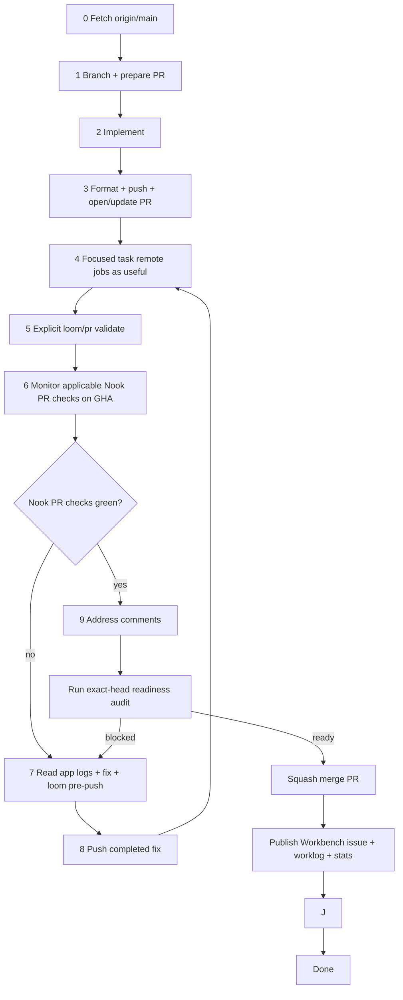

# Pull Request Workflow

Use this checklist for every change that lands on `main`. **AI agents must follow [coding-bro.md](coding-bro.md)** — the default implement-to-merge pipeline — and the detailed [agent pipeline](#agent-pipeline) below. Do not stop at push.

## PR-first agent contract

For implementation tasks, the agent's default job is not "make local edits".
It is "land a PR with Nook's applicable GitHub Actions PR test checks green."

Start by establishing the PR path, then keep ownership until merge or a concrete blocked handoff:

1. **Prepare the PR path first** — fetch `origin/main`, create a feature branch, and define the PR title/body/scope before coding.
2. **Implement functionality** — make the requested code/docs/tests changes on the feature branch. Focused build/test feedback runs on GitHub-hosted workers.
3. **Push and create/update the PR** — run `task loom:pre-push`, push a coherent commit, and open the PR; later fixes update that same PR.
4. **Iterate and validate on GitHub Actions:**
   - Run focused `task remote TASK_NAME=<name>` jobs as useful.
   - When the head is ready, run `task loom:pr-land CONFIG=<pr-land-validate-request.yaml>` (or Task `pr:preflight` / `pr:validate`).
   - Inspect the path-applicable `PR / Verify and preview` and `Web research / Build and deploy research catalog` workflows.
   - Do **not** run a required local `task check` / `task ci:pr`.
5. **Fix Nook's failed PR workflow** — inspect failed logs, consult app logs for web/e2e failures, fix, `task loom:pre-push`, and push the completed fix; the agent explicitly triggers complete validation for the replacement head.
6. **Settle existing review feedback** — inspect current comments and reviews, reply to every actionable human or automated finding, and resolve each thread. Do not request or wait for optional reviewers.
7. **Merge automatically when ready** — after the branch is current with `origin/main`, Nook's applicable repository-owned PR test checks are green, all actionable comments are resolved, and `task loom:pr-land CONFIG=<pr-land-ready-request.yaml>` / `task pr:ready` succeeds, squash-merge immediately without requesting separate permission.

## ⛔ SQUASH MERGE ONLY

**Every PR merged into `main` MUST be squash-merged.**

| Allowed                         | Forbidden                                               |
| ------------------------------- | ------------------------------------------------------- |
| GitHub UI: **Squash and merge** | Create a merge commit                                   |
| CLI: `gh pr merge <n> --squash` | `gh pr merge --merge`                                   |
| One commit per PR on `main`     | `gh pr merge --rebase`                                  |
|                                 | Fast-forward that keeps branch commit history on `main` |

`main` must stay linear: **one squash commit per PR**. Feature branches can have many commits; that history is discarded at merge time.

If you merge a PR for the user, **confirm squash** before completing the merge. Merging any other way is a process violation.

## Agent pipeline

Named **coding bro** in [coding-bro.md](coding-bro.md). End-to-end flow for autonomous agents working on a task:


```mermaid
flowchart TD
  Z[0 Fetch origin/main] --> A[1 Branch + prepare PR]
  A --> I[2 Implement]
  I --> E[3 Format + push + open/update PR]
  E --> X[4 Focused task remote jobs as useful]
  X --> V[5 Explicit loom/pr validate]
  V --> F[6 Monitor applicable Nook PR checks on GHA]
  F --> G{Nook PR checks green?}
  G -->|no| H[7 Read app logs + fix + loom pre-push]
  H --> PUSH[8 Push completed fix]
  PUSH --> X
  G -->|yes| C[9 Address comments]
  C --> R[Run exact-head readiness audit]
  R -->|blocked| H
  R -->|ready| M[Squash merge PR]
  M --> S[Publish Workbench issue + worklog + stats]
  S --> J
  J --> K[Done]
```

### 0. Fetch and branch

Fetch before branching so the feature branch starts from current `origin/main`:

```bash
git fetch origin main
git checkout -b <branch-name> origin/main
```

Never commit directly on `main`.

### 1. Prepare the PR path

Before editing, decide the branch name and PR scope/title/body. The PR may be opened after the first coherent commit, but the work should already be organized around getting that PR green and merged.

### 2. Implement

### 3. Push an exact remote-executable commit

When the branch has a coherent implementation commit, run pre-push hygiene, then commit and push/open or update the PR. This makes the exact source available to focused hosted tasks; it does not start complete PR validation.

Never run `task check`, a full test suite, build, e2e, or post-fix product validation as a required local gate before or after the push. This is not a license to push half-finished or unformatted work: always run `task loom:pre-push` before the push, and push once the branch is coherent enough to validate.

```bash
task loom:pre-push
git push -u origin HEAD
gh pr create --title "…" --body "…"
```

See [pre-push-hygiene.md](../dynamic-skills/pre-push-hygiene.md).

After each push, run useful focused remote tasks. After the final push, explicitly trigger complete validation, inspect feedback already present, and handle every actionable finding. Do not request or wait for external reviewers. See [code-review.md](code-review.md).

The feedback inspection and readiness audit replace any blind review-batching grace period.

### 5. Hosted iteration and explicit validation

**GitHub-hosted execution is the normal build/test path.** `remote.yml` runs allowlisted focused tasks repeatedly against an exact pushed branch head. `pr.yml` is the sole merge-validation pipeline and runs only when an agent explicitly applies a validation label through `task pr:validate`.

```text
implement/fix → task loom:pre-push → commit → push/update PR → focused task remote jobs
→ task loom:pr-land CONFIG=<pr-land-validate-request.yaml> → complete exact-head PR workflow
```

**Required local action** (before every push):

```bash
task loom:pre-push
```

Always run `task loom:pre-push` again before every fix re-push.

Focused hosted commands (never merge gates):

```bash
task remote TASK_NAMES=web:check,web:test
task remote TASK_NAMES=rust:test,rust:coverage
```

Complete validation:

```bash
task pr:validate PR=<number>
# Main-fix PR:
task pr:validate PR=<number> FULL_E2E=1
```

| When                       | Command                                          | Why                                             |
| -------------------------- | ------------------------------------------------ | ----------------------------------------------- |
| Before every push          | `task loom:pre-push`                             | Only required local product action              |
| UI-facing path changes     | included in Loom pre-push                        | Cheap hygiene before hosted execution           |
| Focused build/test feedback| `task remote TASK_NAMES=<a>,<b>`                | Reuse one hosted worker for selected tasks      |
| Final validation boundary  | `task loom:pr-land CONFIG=<pr-land-validate-request.yaml>`     | Start the complete exact-head PR gate           |
| After complete CI failure  | fix → format → commit → push → validate again    | A push does not automatically refresh `pr.yml`  |

See [ci-pipeline.md § Local vs remote CI](ci-pipeline.md#local-vs-remote-ci) and [github-actions-only-validation.md](../dynamic-skills/github-actions-only-validation.md).

Workflow cancellation must follow the scopes in [ci-pipeline.md § Workflow concurrency policy](ci-pipeline.md#workflow-concurrency-policy).

Explicit validation cancels only an older labeled run for the same PR. Unrelated PRs keep independent required checks.

Any cancellable live-provider job must also keep its external-resource cleanup in a separate `if: always()` step. An interrupted test process must not leak provider state.

### 5.1. Main-fix browser validation

Normal PR CI omits browser e2e. A PR fixing a failure observed on `main` must trigger the `ci:full-e2e` validation path, which runs the Main-equivalent local-provider and extension browser suites before merge:

```bash
task pr:validate PR=<number> FULL_E2E=1
```

Agents do not run full e2e locally. Use the remote catalog for focused browser feedback and the explicit Main-fix gate for merge validation.

### 6. Monitor only Nook's applicable PR test checks until green

`pr.yml` runs native Rust and WASM on independent hosted runners.

**Producer and consumer split:**

- After clippy/build, the WASM producer uploads only the small generated package.
- Parallel browser-free preview validation can begin while required Node tests continue.
- Preview deployment remains blocked until the producer succeeds.
- Optional browser-e2e consumers wait for that fully verified producer.
- No consumer recompiles Rust.

**Preview and coverage:**

- Preview deploys the internal harness plus isolated native Pages aliases for site, Simple, and Sentinel without waiting for native coverage.
- A separate native-dependent coverage job downloads the current run's Rust artifact directly.
- When a base comparison is required, it resolves an exact-commit trusted Main artifact.
- It never cold-builds the base revision.
- The isolated site alias is recorded as the successful `github-pages` deployment for ruleset enforcement.

**Main-fix browser jobs:**

- PRs labeled `ci:full-e2e` additionally run independent web and extension jobs on separate hosted runners.
- Each builds the Chromium image from verified WASM.
- The overall `PR` workflow cannot succeed until both jobs succeed.

**Do not stop after opening the PR.** Wait only for applicable repository-owned workflows:

- `PR`
- `Web research` when `.github/workflows/web-research.yml` or `nook-app/nook-web/nook-web-research/**` changes

Never use an all-check watcher that can remain blocked on external services. If neither repository workflow applies to the changed paths, there is no remote check to wait for.

```bash
task pr:preflight PR=<number>
```

Use `task loom:pr-land CONFIG=<pr-land-ready-request.yaml>` (or `task pr:ready`) for a read-only exact-head readiness assertion. The command never merges by itself. Its success is the final signal for the task-owning agent to squash-merge immediately.

Do not request or wait for Codex, Claude, Cursor, CodeRabbit, or any other optional external review/check. Repository-owned checks and exact-head deployment remain required.

Before treating a PR as mergeable, **always verify the branch against the latest `origin/main`**.

Do this every time, even when all visible checks are green.

If a green PR cannot merge, assume the first and most likely blocker is that `main` advanced and the PR branch is stale.

GitHub may surface that stale-branch state as:

- an "Update branch" requirement
- `mergeStateStatus: BLOCKED`
- a missing active check because the green run belongs to an older base

Fetch `main`, compare divergence, and update the PR branch before chasing other branch-policy explanations:

```bash
git fetch origin main
git rev-list --left-right --count HEAD...origin/main
gh pr view <number> --json mergeStateStatus,baseRefOid,headRefOid,statusCheckRollup
```

If the branch is behind `origin/main`, merge the base branch into the PR branch, push, then explicitly validate Nook's workflows on the new head SHA. Do not merge until this freshness check passes:

```bash
git merge origin/main --no-edit
git push origin HEAD
task pr:validate PR=<number>
task pr:ready PR=<number>
```

### 6.1. Address review comments

Actionable PR feedback that already exists must be handled, whether it comes from a human reviewer, Codex, or another automated reviewer. Follow [code-review-comments.md](../dynamic-skills/code-review-comments.md) for the full checklist.

Agents must leave their own GitHub reply explaining the fix, validation, or no-change rationale before resolving any PR comment or review conversation. Do not resolve comments silently. Inspect submitted review bodies as well as inline review threads and PR comments:

```bash
gh pr view <pr-number> --comments
head_sha="$(gh pr view <pr-number> --json headRefOid --jq .headRefOid)"
gh api repos/meta-secret/nook/pulls/<pr-number>/reviews \
  --jq ".[] | {user: .user.login, state, body, html_url, commit_id, current_head: (.commit_id == \"$head_sha\")}"
```

Treat actionable submitted-review bodies as current only when `current_head` is `true`.

Keep older review bodies as audit context. Use thread `isOutdated` state plus the current code when deciding whether an older inline finding still needs a reply.

Use the GitHub review-thread GraphQL query from the [code-review-comments skill](../dynamic-skills/code-review-comments.md) to inspect unresolved inline conversations.

Reply only on actual review threads/comments that support targeted replies.

Track actionable submitted review-body items without a threaded reply target in the checklist/final handoff rather than creating comment spam.

Resolve all actionable threads and re-query immediately before merge.

Do not request or wait for optional external reviews or status changes. See [code-review.md](code-review.md).

### 7. Fix loop on failure

Investigation order: **test output** → **static analysis** → **app logs** (most important after the first two). See [logging.md § Debugging…](../references/logging.md#debugging-troubleshooting-and-ci-verification).

Static analysis includes Knip unused findings and jscpd clone/duplicate findings. Fix those problems in code; do not silence the gate. See [quality.md § Fix check findings](../workflows/quality.md#fix-check-findings--not-silence-them).

1. Read the failed job log: `gh run view <run-id> --log-failed`
2. For **e2e / web failures**, read persisted app logs before changing code: Playwright attachment `nook-app-logs.json`, local `fetchAppLogs(page)` / `/app-logs`, or `dumpNookLogs(page)`.
3. Fix the root cause.
4. Run `task loom:pre-push`, commit, and push the completed fix.
5. Run useful focused `task remote` jobs, then Loom/Task validate and return to monitoring Nook's complete exact-head PR checks.
6. Never request or wait for external review services.

If the failure was obviously fmt-only, `task loom:pre-push` before re-push is enough. Broader failures are proven by the refreshed remote `pr.yml` run on the latest head.

### 8. Merge and finish

When **Nook's applicable repository-owned PR test checks pass**, the branch is current with `origin/main`, all actionable comments are resolved, and `task loom:pr-land CONFIG=<pr-land-ready-request.yaml>` / `task pr:ready` succeeds:

```bash
gh pr merge <number> --squash
```

The successful squash merge completes implementation delivery. Do not wait for, monitor, or live-verify the resulting Main run unless the user explicitly requested deployment/live verification or assigned a Main failure.

After merge, `main.yml` independently runs full local-provider and extension **e2e**.

**Main failure incidents (Hive):**

- Every actionable unsuccessful Main run creates one `automation: hive` Workbench incident keyed by failed SHA.
- This includes `Web e2e`, `UI demos`, and `Extension e2e`.
- Each run attempt creates a run-and-attempt-keyed delivery generation whose plan/worklog are generation-specific.
- A later failed rerun supersedes and cancels an active delivery before the new generation is enqueued.
- The dispatcher retries only after a poll interval longer than the worker heartbeat.
- The durable barrier is the worker's Neo4j acknowledgement that the stale Codex execution stopped.
- The old generation remains `CANCELLING` until worker acknowledgement or confirmed deletion of its recorded Kubernetes Pod, including cancelling exclusive blockers.
- Reconciliation of the current generation is idempotent.
- Successful reruns retire existing incidents and stop active delivery.
- The isolated Hive dispatcher enqueues actionable incidents once.
- One logical task owns diagnosis, a normal exact-head PR, actionable review resolution, squash merge, and verification of the resulting Main run.
- The scheduled `agent-implement.yml` worker does not claim Hive incidents.
- Credentialed sync-live checks are available only through explicit manual validation.

### 9. Post-merge Workbench context and statistics

Every normal AI-agent-owned PR continues through a Workbench publication after merge. Follow [issues.md](issues.md) and [agent-statistics.md](agent-statistics.md):

- Update the associated issue.
- Add the agent worklog.
- Create `stats/ai-agent/<source-pr-number>.yaml`.
- Include all local validation and repository workflow executions/retriggers plus merge attempts and elapsed time.
- Record the repository test inventory on the merged head.
- Compare with recent comparable records and assess waste.

Publish these records directly to `meta-secret/nook-workbench` `main`.

Do not:

- create a bookkeeping Nook branch or PR
- wait for post-merge Main
- include a Main run merely because the implementation PR triggered one

If the comparison identifies actionable performance regression or workflow waste, create a separate normal Nook build-performance PR and take it through the full pipeline.

Completed Main attempts independently commit one automated `stats/main-build/<run-id>-attempt-<attempt>.yaml` record to Workbench after the workflow finishes. Because no Nook ref changes, publication cannot recurse. See [main-build-statistics.md](main-build-statistics.md).

### 10. Task completion report

Every agent turn that **finishes a user-assigned task** must end with a short **completion report** that includes **how long the work took**.

**When to report:** After the task is done — merged implementation PR, delivered answer, or explicit handoff. Do not wait for a post-merge Main run unless deployment/live verification was explicitly requested. Do not omit this on multi-step work that spans monitor/fix/merge cycles; report once at the very end.

**What to measure:** Wall-clock time from when you **started working on the user's request** (first implementation step or investigation for that assignment) until you send the final message. Include CI wait time if you monitored checks as part of the task.

**Format** — add a `## Duration` line (or equivalent) in the final reply:

```markdown
## Duration

12m 34s (started 2026-06-28T20:15:00Z, finished 2026-06-28T20:27:34Z)
```

Rules:

- Use a human-readable duration (`Xm Ys`, or `Xh Ym` when over an hour).
- Include UTC ISO timestamps for start and finish when you can infer them; otherwise duration alone is acceptable.
- If the task was blocked waiting on the user, exclude idle wait time and note `active time: …` vs `elapsed: …`.
- For question-only turns with no implementation, a duration line is optional.

**Docker:** Never kill the Docker daemon — only stop containers (`docker stop`). See [rules.md §5](../rules.md#docker-daemon--never-kill-it).

## Standard flow (summary)

See [coding-bro.md](coding-bro.md) for the numbered 0–12 checklist.

1. Fetch `origin/main`; branch from it.
2. Implement; run `task loom:pre-push`; commit and push/open/update the PR.
3. Use focused `task remote` jobs, then explicitly run Loom/Task validate on the ready head and monitor its repository-owned checks.
4. Never request or wait for optional external reviews/checks.
5. Address and resolve every actionable comment already present.
6. On failure: fix → `task loom:pre-push` → commit/push → focused remote proof as useful → explicitly trigger complete validation again.
7. **Squash merge** into `main` immediately after the exact-head readiness audit succeeds; green checks alone are insufficient.
8. Delete the branch (optional).
9. **Publish** the Workbench issue update, worklog, and statistics; open a separate normal performance PR when the evidence requires a fix.
10. **Report task duration** in the final message (see [§ Task completion report](#10-task-completion-report)).

## CLI reference

```bash
# Open PR
gh pr create --title "…" --body "…"

# Merge (ONLY this form)
gh pr merge <number> --squash
```

See also [rules.md §6](../rules.md#6-git--pull-request-workflow).
