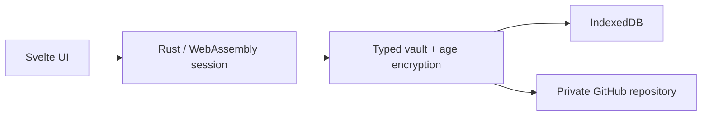

# Nook

[GitHub repository](https://github.com/meta-secret/nook) · [MIT License](LICENSE)

Nook is an open-source, browser-first password and secret manager. It encrypts
credentials on your device and stores the encrypted vault somewhere you control:
locally in the browser or in a private GitHub repository.

There is no Nook account and no central Nook server holding your vault. A browser
becomes an enrolled device with its own local identity; the shared encrypted vault
file is the source of truth.

> [!WARNING]
> Nook is early-stage software. Vault formats and workflows may still change. Do
> not use it as the only copy of important credentials or recovery phrases.

## Why Nook?

Most password managers combine encryption, storage, identity, and synchronization
behind one hosted account. Nook separates those concerns:

- **Your secrets:** plaintext stays inside the browser session.
- **Your storage:** use IndexedDB locally or sync `nook-vault.yaml` to your own
  private GitHub repository.
- **Your devices:** each enrolled browser has a separate X25519 identity whose
  private key never leaves that browser.
- **Your source code:** the cryptography, vault format, synchronization, and UI are
  inspectable in this repository under the MIT license.

Nook currently supports three intentionally small item types:

| Type | Fields |
|---|---|
| Login | Website URL, username, password, optional notes |
| API key | Website URL, key, optional expiration date |
| BIP39 seed phrase | Account name, seed phrase |

Items are grouped by type, searchable by their visible metadata, and masked until
explicitly revealed. The login form includes a cryptographically secure password
generator.

## How it works

1. You choose a storage provider: local browser storage or GitHub.
2. Rust running as WebAssembly creates a device identity and vault encryption keys.
3. Secret data is serialized as type-specific YAML and encrypted independently with
   [age](https://age-encryption.org/).
4. Nook writes the encrypted vault as readable YAML to IndexedDB or GitHub.
5. An enrolled device unwraps the shared vault keys locally and decrypts records only
   for the active browser session.



The Svelte UI does not implement cryptography or vault rules. It collects input,
renders state, and calls the Rust/WASM boundary. Parsing and validation happen in
Rust before data enters the vault.

## Vault and trust model

The default on-disk format is `nook-vault.yaml`. A user item has a plaintext envelope
and encrypted data:

```yaml
secrets:
  - id: 0d86db76-6f91-4eaf-88d8-4629d72198b8
    type: login
    data: |
      -----BEGIN AGE ENCRYPTED FILE-----
      ...
      -----END AGE ENCRYPTED FILE-----
```

Decrypting `data` produces type-specific YAML. Multiline fields remain natural to
read and edit in diagnostic tooling:

```yaml
websiteUrl: https://example.com
username: alice
password: correct horse battery staple
notes: |-
  Personal account.
  Recovery codes are stored offline.
```

The plaintext `type` tells Rust which exact structure to deserialize. Missing type
metadata or data that does not match its declared type is rejected.

The complete vault also contains:

| Section | Purpose |
|---|---|
| `secrets` | Typed user items; each `data` value is independently encrypted |
| `auth` | Per-device envelopes containing the shared `secrets_key` and `members_key` |
| `joins` | Temporary requests from browsers waiting to be enrolled |
| `members` | Encrypted catalog of enrolled device public keys |

Important boundaries:

- Secret data and vault keys are never sent to storage in plaintext.
- Device private keys stay in that browser's IndexedDB.
- GitHub receives the encrypted vault file. The GitHub personal access token is
  saved in browser IndexedDB for reconnect convenience and therefore should be
  treated as locally stored provider credentials.
- The item `id` and `type`, vault membership identifiers, and the existence and size
  of encrypted records are visible to the storage provider.
- Losing every enrolled device means losing the private identities needed to open
  the vault. Enrolling more than one device reduces that recovery risk.

## Multi-device access

Nook does not use a central identity service. To add a browser:

1. The new browser writes a join request to the shared vault.
2. An enrolled browser reviews and approves the request.
3. The approver encrypts the vault keys to the new device's public key.
4. The new browser can then unlock the same vault independently.

The private key remains local to each device. GitHub coordinates the encrypted file;
it does not become the authority that can decrypt it.

## Architecture

The monorepo has a strict one-way dependency flow:

```text
nook-web  →  nook-wasm  →  nook-core
 Svelte       browser       pure Rust
   UI        I/O bridge    domain logic
```

- **`nook-core`** — typed secret model, YAML/JSONL vault formats, age encryption,
  device enrollment, validation, search, and password generation. It has no browser
  dependencies and is tested natively.
- **`nook-wasm`** — `wasm-bindgen` bridge and session manager. It connects the core
  to IndexedDB and the GitHub REST API, caches encrypted records, and exposes small
  JavaScript-friendly operations.
- **`nook-web`** — Svelte 5 and TypeScript presentation layer. It owns forms,
  provider selection, reactive state, clipboard actions, and the vault UI.

The incremental save path encrypts only the changed item. Unchanged ciphertext is
kept in an armored cache and reused when the YAML vault is serialized again.

Deeper documentation lives in [`.cortex/`](.cortex/):

- [Architecture](.cortex/ARCHITECTURE.md)
- [Password manager specification](.cortex/product-specs/password-manager.md)
- [Decentralized multi-device authentication](.cortex/product-specs/decentralized-auth.md)
- [Storage providers and login UX](.cortex/design-docs/auth-providers.md)
- [Engineering principles](.cortex/design-docs/core-beliefs.md)

## Run locally

Prerequisites:

- Docker with Buildx
- [Task](https://taskfile.dev/)

The Taskfile is the command surface for the repository; Rust, Bun, wasm-pack, and
other build tools run inside the project container.

```sh
task setup
task web:dev
```

Open [http://localhost:5173](http://localhost:5173).

To use GitHub storage, connect a personal access token in the UI. Nook creates the
selected repository as private when it does not already exist and stores the
encrypted vault at `nook-vault.yaml`.

## Development

Common commands:

```sh
task check                 # format, lint, tests, diagnostics, and builds
task build                 # Rust, WASM, and production web build
task web:dev               # local Vite development server
task web:test              # web unit tests
task web:test:e2e:local    # local-vault Playwright suite
task web:test:e2e          # complete Playwright suite; GitHub PAT required
```

GitHub end-to-end tests read `NOOK_GITHUB_PAT` from the environment or
`nook-web/.env.test.local`; see `nook-web/.env.test.example`. Test repositories are
cleaned up automatically.

Architecture changes should begin in the lowest appropriate layer. Portable domain
logic belongs in `nook-core`, browser I/O in `nook-wasm`, and presentation behavior
in `nook-web`. CI enforces formatting, Clippy warnings, Rust tests, Svelte and
TypeScript diagnostics, ESLint, Prettier, Vitest, and production builds.

## License

Nook is available under the [MIT License](LICENSE).
