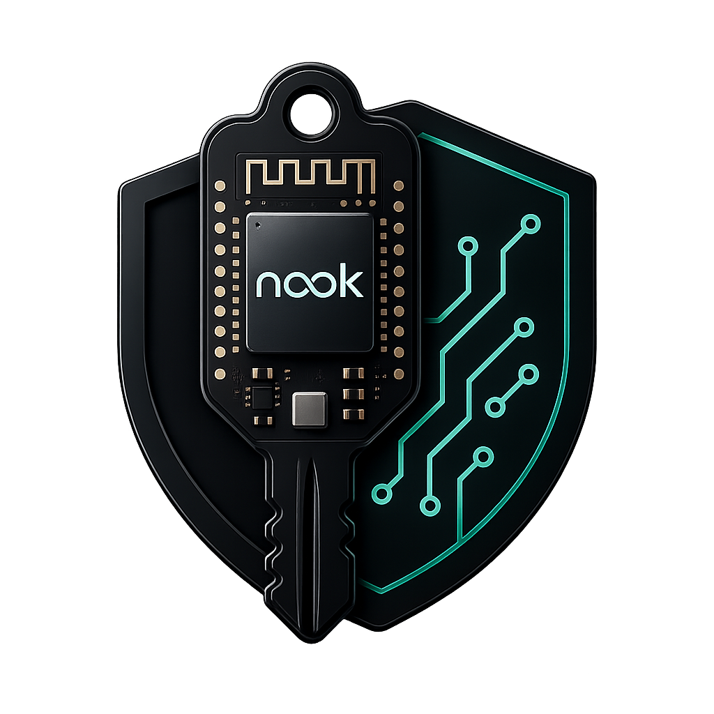

# Nook

<p align="center">
  
</p>

<p align="center"><strong>Keys, not accounts.</strong></p>

<p align="center">
  <a href="https://nokey.sh">Site</a> ·
  <a href="https://simple.nokey.sh">Simple Vault</a> ·
  <a href="https://sentinel.nokey.sh">Sentinel Vault</a> ·
  <a href="https://github.com/meta-secret/nook">GitHub</a> ·
  <a href="LICENSE">MIT License</a>
</p>

Nook is a passwordless, local-first secrets manager. Your vault is encrypted in
the browser, replicated only through storage you choose, and opened only by
identities you authorize.

There is no Nook account. There is no master password. Approved devices unlock
the vault.

> [!WARNING]
> Nook is early-stage software. Vault formats and workflows may still change.
> Do not use it as the only copy of important credentials or recovery phrases.

## Choose a vault

| Vault | Best for | URL |
| ----- | -------- | --- |
| **Simple** | Everyday passwords and secrets | [simple.nokey.sh](https://simple.nokey.sh) |
| **Sentinel** | Quorum-protected high-value secrets | [sentinel.nokey.sh](https://sentinel.nokey.sh) |

They are independent applications and browser origins, not modes in one app.
The browser extension pairs only with Simple Vault.

After you pick a product, the first-device screen offers two intents: create a
new vault, or connect a sync provider for an existing compatible vault.

## Why Nook?

Most password managers give you one master password. You must remember it. It
can be phished. Lose it, and you may lose the vault.

Nook replaces that with device keys and deliberate consent:

- **Device controlled.** Authority lives with approved devices and
  cryptographic identities — not a central account database.
- **Ciphertext outside.** Secrets are encrypted before leaving the client.
  Providers carry data without owning access.
- **Consent required.** New devices and sensitive operations need visible,
  deliberate authorization. There is no account-reset service that can recover
  the vault for you.
- **Open machinery.** The code, protocols, and trade-offs are built in the open.

Unlock this browser with a passkey (WebAuthn PRF) or PIN fallback. GitHub,
Google Drive, iCloud, and local-folder sync are available today; more providers
are planned. Google Drive and iCloud can use either a private store or a share
across accounts — enrollment transfers only the stable share target; each
browser signs in independently.

One trade-off: if you lose every approved device (and any recovery path you
configured), you lose the vault. Approve at least two devices.

## What you can store

| Type | Fields |
| ---- | ------ |
| Login | Website URL, username, password, optional notes |
| API key | Website URL, key, optional expiration date |
| BIP39 seed phrase | Account name, seed phrase |
| Secure note | Title, note (Markdown) |
| Passkey | Website/RP and account metadata; encrypted ES256 credential |
| Authenticator | Service, account, and TOTP setup key or `otpauth://` URI; browser extension can also enroll from a consented settings-page QR and attach reviewed backup codes |

Items are searchable through a browser-local encrypted catalog of list fields.
The catalog is decrypted into WASM memory only while the vault is unlocked.
Passwords, API keys, note bodies, seed phrases, full card numbers, OTP seeds,
passkey private keys, backup codes, and file contents are excluded. Secret
values stay masked until revealed. Authenticator items derive the current
one-time code locally in Rust/WASM and never persist generated codes. Nook also
includes a secure password generator.

Vault items are append-only in the UI: add, reveal, copy, delete. To change an
item, add a corrected copy and delete the old one.

## Browser extension

Add Nook to Chrome or Brave for permissioned password filling, TOTP auto-fill,
and passkey use from an approved, unlocked Simple Vault.

The extension is a separately protected device. It pairs only with Simple
Vault; Sentinel never participates. Passkey generation, RP validation, signing,
and counter updates stay in Rust/WASM. On recognized one-time-code fields, the
user chooses a saved authenticator and the extension fills a freshly derived
code. Settings-page QR enrollment and backup-code capture require the same
explicit Pilot consent and confirmation before anything is saved.

Production installs through the Chrome Web Store (Brave uses the same listing).
Development and PR previews offer an unsigned ZIP with Developer-mode install
instructions; see [Deployments](#deployments).

## Import from other managers

| Source | Format | What imports |
| ------ | ------ | ------------ |
| Bitwarden | JSON (plaintext or password-protected) | Logins, secure notes, credit cards |
| LastPass | Unencrypted generic CSV | Logins, secure notes |
| 1Password | Unencrypted 1PUX | Logins, passwords, secure notes, credit cards |
| Apple Passwords | Unencrypted CSV | Website logins, TOTP |
| Chrome / Chromium / Brave / Edge | Unencrypted password CSV | Website logins |
| Proton Pass | Unencrypted ZIP or decrypted `data.json` | Logins, secure notes, credit cards |
| Google Authenticator | Migration QR codes (camera or images) | TOTP accounts |

Unsupported item types and attachments are skipped. Account-restricted Bitwarden
exports are not portable. PGP-encrypted Proton Pass exports must be decrypted
first.

Overlapping records reconcile with vault-keyed item-identity and secret-version
HMAC fingerprints. Matching secret versions enrich the existing item; differing
passwords stay as separate items instead of being overwritten.

## How it works

### Local-first vault

1. Open **Simple Vault** for everyday secrets or **Sentinel Vault** for a
   quorum safe. Sentinel member devices enter only through an owner-issued
   invitation.
2. Creating a **Simple** vault on the website protects this browser with a
   passkey or PIN. When creation starts from the unlocked extension, the
   extension's protected device identity creates the vault instead.
   **Sentinel** runs quorum / SLIP-0039 setup: the owner shares an invitation
   URL, each participant connects a protected device and returns a signed
   response, then the owner distributes encrypted shares and completes the
   first quorum unlock. Sync providers are optional and added later from
   inside the vault.
3. Secrets are encrypted in Rust/WASM before anything is written to storage.
4. The browser keeps an encrypted local copy. Sync providers are optional
   **replicas** of the same vault, not separate databases.

### When you come back

- Unlock with this browser's passkey/PIN-protected device keys, or use a backup
  password to open the encrypted local vault directly. A vault created with the
  extension identity prefers that approved identity whenever the extension is
  unlocked.
- Importing an existing remote vault first reuses its paired extension identity
  when available. A locked extension opens its own unlock window; without the
  extension, the website asks for this browser's passkey or PIN before connect.
- A backup-password session leaves the protected device identity and saved sync
  credentials locked. Authorize with the passkey or PIN when you want remote
  sync to resume.
- Decrypted secrets exist only in the active browser session. Reveal and copy
  decrypt one item on demand, then free it when that action ends.
- Public list/search metadata is cached separately in IndexedDB so large-vault
  search does not decrypt every item. Cached rows are integrity-bound to the
  vault key and their encrypted records. **Lock vault** clears vault keys and
  any revealed secret values; encrypted data, public search metadata, and providers stay.

### When you add another device

1. Open Nook in the new browser and request to join.
2. Approve the request on an enrolled device.
3. The new device receives vault keys sealed to its public key and can unlock
   independently.

### Four architecture layers

| Layer | What it does |
| ----- | ------------ |
| Device identity | Each authorized device holds a protected X25519 identity. Plaintext identity material exists only in an unlocked session. |
| Key envelopes | Vault keys are wrapped per device so authorized identities unlock secrets without a central authority. |
| Sync transport | Optional providers move encrypted vault events; they see ciphertext and storage ops, not secrets. |
| Event log | Content-addressed, signed events form a causal DAG so replicas converge without a central sequencer. |

```text
local command
  → signed encrypted event
  → IndexedDB event store
  ↔ set union ↔ GitHub (nook-log/v1/events/…)
  → causal DAG + deterministic projection
  → encrypted session + encrypted local search catalog
  → one-record plaintext exposure on reveal/copy (unlocked only)
```

Cryptography and domain logic run in Rust compiled to WebAssembly. Secret
payloads are typed YAML encrypted with [age](https://age-encryption.org/).

## Architecture

App code lives under `nook-app/`. Dependencies flow one way:

```text
nook-vault-simple / nook-vault-sentinel / nook-web-extension
        ↓
   nook-wasm          browser I/O + session bridge
        ↓
   nook-core          vault events, sync, secrets, projection
        ↓
   nook-auth2         device identity, envelopes, vault key access
```

| Package | Role |
| ------- | ---- |
| `nook-auth2` | Portable key access: device identities, age envelopes, recovery helpers |
| `nook-core` | Domain: event log, causal merge, projection, typed secrets, sync policy |
| `nook-wasm` | `wasm-bindgen` bridge, IndexedDB / GitHub I/O, session manager |
| `nook-vault-simple` | Independent Svelte 5 Simple Vault application |
| `nook-vault-sentinel` | Independent Svelte 5 Sentinel Vault application |
| `nook-web-app` | Public site and unified local e2e harness |
| `nook-web-extension` | Simple-only Manifest V3 companion (Nook Pilot: login HUD, credential fill, takeover) |
| `nook-web-shared` | Presentation/browser glue safe to share between vault apps |

Deeper documentation lives in [`.cortex/`](.cortex/):

- [Architecture](.cortex/ARCHITECTURE.md)
- [Vault event log](.cortex/design-docs/vault-event-log.md)
- [Unified vault / local-first](.cortex/design-docs/unified-vault.md)
- [Vault session and lock](.cortex/design-docs/vault-session-and-lock.md)
- [Password manager](.cortex/product-specs/password-manager.md)
- [Decentralized multi-device auth](.cortex/product-specs/decentralized-auth.md)
- [Engineering principles](.cortex/design-docs/core-beliefs.md)
- [Agent map](.cortex/AGENTS.md)

## Deployments

| Channel | Site | Simple | Sentinel |
| ------- | ---- | ------ | -------- |
| Production | [nokey.sh](https://nokey.sh) | [simple.nokey.sh](https://simple.nokey.sh) | [sentinel.nokey.sh](https://sentinel.nokey.sh) |
| Main (dev) | [dev.nokey.sh](https://dev.nokey.sh) | [simple.dev.nokey.sh](https://simple.dev.nokey.sh) | [sentinel.dev.nokey.sh](https://sentinel.dev.nokey.sh) |
| Pull requests | Cloudflare `pr-<number>.<project>.pages.dev` branch aliases | matching Simple alias | matching Sentinel alias |

Each PR site and `dev.nokey.sh` publish a browser-extension ZIP under
`/downloads/`. Immutable production releases publish the versioned ZIP at
`nokey.sh` and on the GitHub Release. Production installs go through the Chrome
Web Store; the ZIP remains a verifiable release artifact.

## Run locally

Prerequisites:

- Docker with Buildx
- [Task](https://taskfile.dev/)

The root `Taskfile.yml` is the repository entrypoint. Compile, test, and
package installs run inside the project container.

```sh
task web:dev
```

The first run builds a pinned `mkcert` utility container, writes ignored TLS
material under `.nook/https/`, and asks the host OS to trust that local CA.
Open [https://localhost:5173](https://localhost:5173) for the landing page, or
[https://localhost:5173/app/](https://localhost:5173/app/) for the unified
local test harness. Production builds are `bun run build` inside
`nook-vault-simple` and `nook-vault-sentinel`; they never use a hostname flag
to select a vault type.

All web surfaces consume one audited `nook-wasm` package compiled once. Each
entrypoint configures its immutable Rust-owned application identity before
loading app modules, so Simple and Sentinel remain separate projects and
origins without recompiling the same Rust library per surface.

`setup` runs automatically before docker tasks and rebuilds the `nook-web:local`
image so it reflects current source. Buildx prepares the Rust/WASM and web
dependency branches in parallel, exports generated WASM and coverage through a
commit-scoped host directory, then builds a web-only image. Concurrent builds
cannot consume each other's handoff; Rust `target/` and the compiler toolchain
never enter `nook-web:local`.

Before local Rust compilation, Task idempotently starts a Docker-host-only
`nook-sccache-redis` container so short-lived compilers can reuse compatible
crate compiler outputs. Trusted default-branch and normal nightly GitHub jobs
instead reach the password-protected persistent Redis service deployed from
[`infra/`](infra/) through Cloudflare Access. Pull requests, arbitrary refs,
dependency-update agents, and AI-authored jobs retain the no-secrets job-local
fallback. Local builds need no remote credentials. Override local
defaults with `SCCACHE_REDIS_PORT`, `SCCACHE_REDIS_MAXMEMORY`, or
`SCCACHE_REDIS_IMAGE`. Runtime containers receive an explicit 1,048,576
open-file limit; override with `DOCKER_NOFILE_LIMIT`.

macOS has no inotify; Docker workloads use the inotify implementation in Docker
Desktop's Linux VM. Reapply after Docker Desktop restarts:

```sh
docker run --rm --privileged --pid=host busybox:1.37.0 \
  sysctl -w \
  fs.inotify.max_user_instances=2500 \
  fs.inotify.max_user_watches=10485760
```

On Linux development hosts, raise and persist the same kernel-wide limits:

```sh
sudo sysctl -w fs.inotify.max_user_instances=2500
sudo sysctl -w fs.inotify.max_user_watches=10485760
printf '%s\n' \
  'fs.inotify.max_user_instances=2500' \
  'fs.inotify.max_user_watches=10485760' \
  | sudo tee /etc/sysctl.d/99-nook-docker.conf
sudo sysctl --system
```

To raise macOS file-descriptor ceilings by 10×:

```sh
sudo sysctl -w kern.maxfiles=2764800
sudo sysctl -w kern.maxfilesperproc=1382400
sudo launchctl limit maxfiles 1382400 2764800
```

The launchd limit applies to newly launched processes — reopen affected
terminals afterward.

To use GitHub sync, connect a personal access token in the UI. Nook stores the
encrypted event log under `nook-log/v1/events/` in a private repository.

## Development

Agent workflow: run **`task format`** before every push; product gates
(`check`, lint, tests, coverage, builds, e2e) run on **GitHub Actions**. Local
Task mirrors below remain available for humans and optional debugging.
PRs that fix a failure observed on `main` must carry the `ci:full-e2e` label;
the PR workflow then requires the Main-equivalent local-provider, app-isolation,
and extension browser suites before merge.

```sh
task format                # required local agent action (host-applied)
task check                 # format, lint, tests, coverage floor, builds (optional local / CI mirror)
task preflight             # fast Rust checks for whole-repository invariants
task build                 # Rust, WASM, web, and extension production build
task web:dev               # trusted-HTTPS local Vite development server
task web:test              # web unit tests
task web:test:e2e:pr       # fast Playwright subset (IndexedDB / local provider)
task web:test:e2e:isolation # Simple/Sentinel project and origin boundary suite
task web:test:e2e          # full local-provider Playwright suite (no PAT)
task web:test:e2e:sync-live  # live GitHub sync e2e (requires NOOK_GITHUB_PAT)
task ui:demo               # record dedicated headless Playwright demos to ui-demo-results/
task extension:build       # browser extension package
task extension:check:fast  # host-cached extension format/unit/manifest/security gate
task extension:build:localhost # local-only identity targeting trusted HTTPS localhost
task extension:install:hosted PR=410 # verify and install an isolated hosted PR build
task extension:smoke:hosted CHANNEL=dev # disposable Chromium hosted extension + Simple Vault smoke
task extension:setup:brave CHANNEL=dev # Brave PIN bootstrap: install, create vault, approve, leave open
task extension:run:chrome CHANNEL=dev # Chrome for Testing auto-loads; branded Chrome opens one-time setup
task extension:run:brave CHANNEL=prod # launch a hosted build in an isolated Brave profile (no vault setup)
task ci:pr                 # health-checked BuildKit mirror of the non-browser PR gate (optional)
task ci:pr:e2e             # explicit full web + extension e2e validation (optional)
task pr:preflight PR=410   # JSON audit: base, policy, exact-head runs/deployments, feedback
task pr:review PR=410      # optional idempotent exact-head Codex review request
task pr:ready PR=410       # read-only exact-head readiness assertion; never merges
task docker:coverage:export  # coverage-only CI fallback (no app image export)
task sccache:stats          # shared compiler-cache keys, memory, hits, and misses
task infra:deploy           # deploy private Redis and future loopback-only registry
task infra:status           # inspect the remote infrastructure stack
task infra:redis:stats      # remote compiler-cache memory and hit statistics
```

UI-facing pull requests must add or update a focused
`e2e/demos/*.demo.spec.ts`. PR CI records those specs in headless Chromium and
keeps the videos as a 90-day workflow artifact linked from the PR. Demo specs
may pause briefly at meaningful UI states; regression e2e remains full-speed.
From `nook-app/`, `cargo ui-demo` is an alias for `task ui:demo`.

Live sync e2e reads `NOOK_GITHUB_PAT` from the environment or
`nook-app/nook-web/nook-web-app/.env.test.local`; see
`.env.test.example` next to that file.

Architecture changes belong in the lowest appropriate layer: key access in
`nook-auth2`, domain logic in `nook-core`, browser I/O in `nook-wasm`, UI in
`nook-web-*`. When package boundaries, sync model, or public Task commands
change, update this README in the same change (see
[`.cortex/AGENTS.md`](.cortex/AGENTS.md)).

### Docker dependency caches

Docker builds use [cargo-chef](https://github.com/LukeMathWalker/cargo-chef)
and independent **linux/amd64** Rust, web dependency, and browser lineages.
GitHub Actions runs PR, main, and release validation on `ubuntu-latest`; each
fresh VM restores distinct BuildKit v2 cache scopes. Main refreshes the
default-branch cache that new PRs may restore. Each PR cache generation is
addressed by PR number, workflow job, the `nook-app` Git tree, and
`.dockerignore`. Its first solve may seed from Main and exports only to that
private generation. Once its required cache indices exist, later pushes and
reruns read the generation without rewriting it or mixing mutable exporters.
Job ownership also prevents the native, WASM, and verify jobs from replacing
one another's overlapping Rust cache lineage. A missing generation may seed
from the newest complete generation owned by the same PR/job, read-only, before
falling back to Main; BuildKit then rebuilds only inputs that actually changed.

Workspace source is copied into the slim `nook-web:local` image (sealed image;
no runtime bind mount except `task web:dev`). Explicit `task rust:*` and
`task wasm:*` commands load a separate source-sealed Rust image on demand.

Rust compilation has a second cache boundary below Docker layers: pinned
`sccache` clients use Redis to reuse compatible source-sensitive compiler
outputs. Delivery CI always uses a job-local Docker-host-only Redis service and
never mounts remote-cache credentials into Rust build steps, so Main and pull
requests restore identical BuildKit dependency and source layers. Local builds
use the same Docker-host-only service. The authenticated Cloudflare Access path
to the server cache remains available for explicit trusted operations, outside
delivery builds. Redis does not cache Cargo downloads or Docker layers.
PR CI also caches the small native coverage and generated WASM handoffs under
exact hashes of their Rust, toolchain, Docker, Task, and workflow inputs.
Repository invariant preflight still runs on every head; an exact handoff hit
skips only Rust/WASM validation already completed for those identical inputs.
The loopback-only OCI registry in [`infra/`](infra/) is deployed for a future
Docker cache migration but is intentionally unused by CI today. Details:
[`.cortex/ARCHITECTURE.md`](.cortex/ARCHITECTURE.md) §7.

After changing Rust dependencies, commit the updated lockfile:

```sh
cd nook-app && cargo generate-lockfile
git add nook-app/Cargo.lock
```

## License

Nook is available under the [MIT License](LICENSE).
