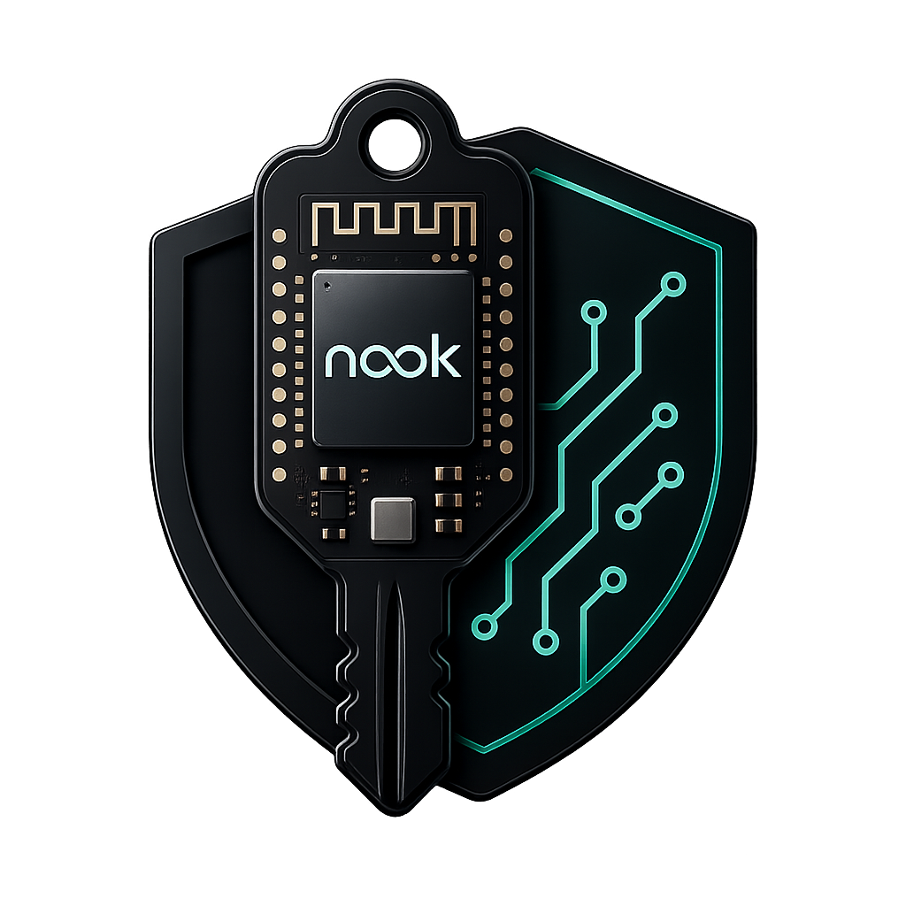

# Nook

<p align="center">
  
</p>

<p align="center"><strong>Keys, not accounts.</strong></p>

<p align="center">
  <a href="https://nokey.sh">Site</a> ·
  <a href="https://simple.nokey.sh">Simple Vault</a> ·
  <a href="https://sentinel.nokey.sh">Sentinel Vault</a> ·
  <a href="https://github.com/meta-secret/nook">GitHub</a> ·
  <a href="LICENSE">MIT License</a>
</p>

Nook is a passwordless, local-first secrets manager. Your vault is encrypted in
the browser, replicated only through storage you choose, and opened only by
identities you authorize.

There is no centrally hosted Nook account and no master password. The shipped
applications authorize vault access with protected device identities. Nook's
target architecture adds local-first virtual identities as durable
authorization subjects; those identity records are encrypted and replicated
through storage you choose, not owned by a Nook account service. See the
[identity and vault architecture](.cortex/design-docs/identity-vault-architecture.md)
for the implemented/target boundary.

> [!WARNING]
> Nook is early-stage software. Vault formats and workflows may still change.
> Do not use it as the only copy of important credentials or recovery phrases.

## Choose a vault

| Vault        | Best for                            | URL                                            |
| ------------ | ----------------------------------- | ---------------------------------------------- |
| **Simple**   | Everyday passwords and secrets      | [simple.nokey.sh](https://simple.nokey.sh)     |
| **Sentinel** | Quorum-protected high-value secrets | [sentinel.nokey.sh](https://sentinel.nokey.sh) |

They are independent applications and browser origins, not modes in one app.
The browser extension pairs only with Simple Vault.

After you pick a product, the first-device screen offers two intents: create a
new vault, or connect a sync provider for an existing compatible vault.

## Why Nook?

Most password managers give you one master password. You must remember it. It
can be phished. Lose it, and you may lose the vault.

Nook replaces that with device keys and deliberate consent:

- **Locally controlled.** Today authority lives with approved device keys; the
  target identity model groups installation-specific device keys under
  encrypted virtual identities. Neither model depends on a central account
  database.
- **Ciphertext outside.** Secrets are encrypted before leaving the client.
  Providers carry data without owning access.
- **Consent required.** New devices and sensitive operations need visible,
  deliberate authorization. There is no account-reset service that can recover
  the vault for you.
- **Open machinery.** The code, protocols, and trade-offs are built in the open.

Unlock this browser with a passkey (WebAuthn PRF) or PIN fallback. GitHub,
Google Drive, iCloud, and local-folder sync are available today; more providers
are planned. Google Drive and iCloud can use either a private store or a share
across accounts — enrollment transfers only the stable share target; each
browser signs in independently.

One trade-off: if you lose every approved device (and any recovery path you
configured), you lose the vault. Approve at least two devices.

## What you can store

| Type              | Fields                                                                                                                                                         |
| ----------------- | -------------------------------------------------------------------------------------------------------------------------------------------------------------- |
| Login             | Website URL, username, password, optional notes                                                                                                                |
| API key           | Website URL, key, optional expiration date                                                                                                                     |
| BIP39 seed phrase | Account name, seed phrase                                                                                                                                      |
| Secure note       | Title, note (Markdown)                                                                                                                                         |
| Passkey           | Website/RP and account metadata; encrypted ES256 credential                                                                                                    |
| Authenticator     | Service, account, and TOTP setup key or `otpauth://` URI; browser extension can also enroll from a consented settings-page QR and attach reviewed backup codes |

Items are searchable through a browser-local encrypted catalog of list fields.
The catalog is decrypted into WASM memory only while the vault is unlocked.
Passwords, API keys, note bodies, seed phrases, full card numbers, OTP seeds,
passkey private keys, backup codes, and file contents are excluded. Secret
values stay masked until revealed. Authenticator items derive the current
one-time code locally in Rust/WASM and never persist generated codes. Nook also
includes a secure password generator.

Supported vault items can be edited in place. Replacement validation,
encryption, and persistence stay in Rust/WASM. Passkey private material remains
non-editable.

## Browser extension

Add Nook to Chrome or Brave for permissioned password filling, TOTP auto-fill,
and passkey use from an approved, unlocked Simple Vault.

The extension is a separately protected device. It pairs only with Simple
Vault; Sentinel never participates. Passkey generation, RP validation, signing,
and counter updates stay in Rust/WASM. On recognized one-time-code fields, the
user searches and chooses from all saved authenticator items in an
extension-owned 2FA picker, and the extension fills a freshly derived code.
Issuer and account labels never enter the website DOM. Settings-page QR
enrollment and backup-code capture require the same explicit Pilot consent and
confirmation before anything is saved.

The extension keeps its own encrypted vault projection, pairing grants, and
sync-provider grants in extension-owned IndexedDB. Clearing website-local vault
data does not erase or revoke that independent extension device. Reopening the
same vault store reconnects it automatically; opening a different vault shows
the extension's current vault identity and requires an explicit, valid switch.

Production installs through the Chrome Web Store (Brave uses the same listing).
Development and PR previews offer an unsigned ZIP with Developer-mode install
instructions; see [Deployments](#deployments).

## Import from other managers

| Source                           | Format                                   | What imports                                  |
| -------------------------------- | ---------------------------------------- | --------------------------------------------- |
| Bitwarden                        | JSON (plaintext or password-protected)   | Logins, secure notes, credit cards            |
| LastPass                         | Unencrypted generic CSV                  | Logins, secure notes                          |
| Keeper                           | Unencrypted CSV                          | Logins, secure notes                          |
| 1Password                        | Unencrypted 1PUX                         | Logins, passwords, secure notes, credit cards |
| Apple Passwords                  | Unencrypted CSV                          | Website logins, TOTP                          |
| Chrome / Chromium / Brave / Edge | Unencrypted password CSV                 | Website logins                                |
| Proton Pass                      | Unencrypted ZIP or decrypted `data.json` | Logins, secure notes, credit cards            |
| Google Authenticator             | Migration QR codes (camera or images)    | TOTP accounts                                 |

Unsupported item types and attachments are skipped. Account-restricted Bitwarden
exports are not portable. PGP-encrypted Proton Pass exports must be decrypted
first.

Overlapping records reconcile with vault-keyed item-identity and secret-version
HMAC fingerprints. Matching secret versions enrich the existing item; differing
passwords stay as separate items instead of being overwritten.

## How it works

### Local-first vault

1. Open **Simple Vault** for everyday secrets or **Sentinel Vault** for a
   quorum safe. Sentinel member devices enter only through an owner-issued
   invitation.
2. Creating a **Simple** vault on the website protects this browser with a
   passkey or PIN. When creation starts from the unlocked extension, the
   extension's protected device identity creates the vault instead.
   **Sentinel** runs quorum / SLIP-0039 setup: the owner shares an invitation
   URL, each participant connects a protected device and returns a signed
   response, then the owner distributes encrypted shares and completes the
   first quorum unlock. Sync providers are optional and added later from
   inside the vault.
3. Secrets are encrypted in Rust/WASM before anything is written to storage.
4. The browser keeps an encrypted local copy. Sync providers are optional
   **replicas** of the same vault, not separate databases.

### When you come back

- Unlock with this browser's passkey/PIN-protected device keys, or use a backup
  password to open the encrypted local vault directly. A vault created with the
  extension identity prefers that approved identity whenever the extension is
  unlocked.
- Importing an existing remote vault first reuses its paired extension identity
  when available. A locked extension opens its own unlock window; without the
  extension, the website asks for this browser's passkey or PIN before connect.
- A backup-password session leaves the protected device identity and saved sync
  credentials locked. Authorize with the passkey or PIN when you want remote
  sync to resume.
- Decrypted secrets exist only in the active browser session. Reveal and copy
  decrypt one item on demand, then free it when that action ends.
- Public list/search metadata is cached separately in IndexedDB so large-vault
  search does not decrypt every item. Cached rows are integrity-bound to the
  vault key and their encrypted records. **Lock vault** clears vault keys and
  any revealed secret values; encrypted data, public search metadata, and providers stay.

### Devices & access

Open **Devices & access** from the login screen or the authenticated **Access**
tab. The page shows the access chain: what unlocks this browser, the device key
that protection unlocks, and which vaults that key has opened. Local identity
state stays visible but is not treated as membership created by the passkey.
Privacy-safe passkey evidence and vault-access details remain available below
the graph. Unknown and last-known facts stay explicit. The page remains useful
before a vault exists and while every vault is locked. See the [product
specification](PRODUCT.md) for the access model and honest limits on
passkey-provider visibility.

### When you add another device

1. Open Nook in the new browser and request to join.
2. Approve the request on an enrolled device.
3. The new device receives vault keys sealed to its public key and can unlock
   independently.

### Current shipped architecture layers

| Layer           | What it does                                                                                                              |
| --------------- | ------------------------------------------------------------------------------------------------------------------------- |
| Device identity | Each authorized device holds a protected X25519 identity. Plaintext identity material exists only in an unlocked session. |
| Key envelopes   | Vault keys are wrapped per device so authorized identities unlock secrets without a central authority.                    |
| Sync transport  | Optional providers move encrypted vault events; they see ciphertext and storage ops, not secrets.                         |
| Event log       | Content-addressed, signed events form a causal DAG so replicas converge without a central sequencer.                      |

The target architecture keeps these vault and event-log boundaries while
introducing virtual identity records and explicit identity-to-vault grants.
The browser now stores a local identity directory and selected identity.
It migrates the former singleton identity record on first read.
Local encrypted identity-to-vault grants are implemented for Simple vaults.
Virtual-identity association for quorum-protected Sentinel vaults, replicated
grant enforcement, and identity-control logs remain future work.

```text
local command
  → signed encrypted event
  → IndexedDB event store
  ↔ set union ↔ GitHub (nook-log/v1/events/…)
  → causal DAG + deterministic projection
  → encrypted session + encrypted local search catalog
  → one-record plaintext exposure on reveal/copy (unlocked only)
```

Cryptography and domain logic run in Rust compiled to WebAssembly. Secret
payloads are typed YAML encrypted with [age](https://age-encryption.org/).

## Architecture

App code lives under `nook-app/`. Dependencies flow one way:

```text
nook-vault-simple / nook-vault-sentinel / nook-web-extension
  ├─> nook-wasm              browser I/O + full vault session bridge
  │    ├─> nook-core         vault application services, secrets, sync policy
  │    │    ├─> nook-authenticator-domain
  │    │    ├─> nook-event-log
  │    │    │    ├─> nook-auth2
  │    │    │    └─> nook-replication
  │    │    └─> nook-app-common
  │    └─> nook-companion-core
  │         ├─> nook-authenticator-domain
  │         └─> nook-event-log
  └─> nook-companion-wasm   size-sensitive extension policy bridge
       └─> nook-companion-core

nook-auth2 ─┬─> nook-authenticator-domain
            └─> nook-app-common
```

`nook-app-common` is a leaf dependency used directly by both `nook-auth2` and
`nook-core`; it does not sit between the event-log and replication layers.

| Package                     | Role                                                                                                                                                              |
| --------------------------- | ----------------------------------------------------------------------------------------------------------------------------------------------------------------- |
| `nook-app-common`           | Dependency-light shared Rust primitives, locale catalogs, translation behavior, and the single generated Rust i18n key registry                                   |
| `nook-authenticator-domain` | Dependency-light closed values for passkey protection, TOTP metadata, and backup-code update policy shared across authentication, vault, and extension boundaries |
| `nook-auth2`                | Portable key access: device identities, age envelopes, recovery helpers                                                                                           |
| `nook-replication`          | Portable replication: causal DAG indexing, append-only replica sets, outbox and repair planning                                                                   |
| `nook-event-log`            | Portable vault history: canonical signed events, actor authorization, deterministic projection, key epochs                                                        |
| `nook-core`                 | Vault application domain: typed plaintext secrets, encryption workflows, provider-neutral sync and session policy                                                 |
| `nook-companion-core`       | Portable extension policy: authentication workflow, pairing records and migration, host and field classification                                                  |
| `nook-companion-wasm`       | Small `wasm-bindgen` bridge exposing companion policy to extension contexts                                                                                       |
| `nook-wasm`                 | Full `wasm-bindgen` bridge, IndexedDB / GitHub I/O, session manager; depends on both vault and companion domain crates                                            |
| `nook-vault-simple`         | Independent Svelte 5 Simple Vault application                                                                                                                     |
| `nook-vault-sentinel`       | Independent Svelte 5 Sentinel Vault application                                                                                                                   |
| `nook-web-app`              | Public site and unified local e2e harness                                                                                                                         |
| `nook-web-extension`        | Simple-only Manifest V3 companion (Nook Pilot: login HUD, credential fill, takeover)                                                                              |
| `nook-web-shared`           | Presentation/browser glue safe to share between vault apps                                                                                                        |

Inside `nook-web-shared/src/vault-app/lib`, browser-owned modules are grouped by
capability (`app`, `auth`, `content`, `enrollment`, `extension`, `runtime`, and
`vault`). Provider-specific authentication adapters live under `auth/google`
and `auth/icloud`; portable provider policy remains in Rust.

Deeper documentation lives in [`.cortex/`](.cortex/):

- [Architecture](.cortex/ARCHITECTURE.md)
- [Vault event log](.cortex/design-docs/vault-event-log.md)
- [Unified vault / local-first](.cortex/design-docs/unified-vault.md)
- [Vault session and lock](.cortex/design-docs/vault-session-and-lock.md)
- [Password manager](.cortex/product-specs/password-manager.md)
- [Decentralized multi-device auth](.cortex/product-specs/decentralized-auth.md)
- [Engineering principles](.cortex/design-docs/core-beliefs.md)
- [Agent map](.cortex/AGENTS.md)

Development issues, agent worklogs, and delivery statistics live in the
versioned [Nook Workbench](https://github.com/meta-secret/nook-workbench)
instead of this repository's GitHub Issues or source tree.

## Deployments

| Channel       | Site                                                        | Simple                                             | Sentinel                                               |
| ------------- | ----------------------------------------------------------- | -------------------------------------------------- | ------------------------------------------------------ |
| Production    | [nokey.sh](https://nokey.sh)                                | [simple.nokey.sh](https://simple.nokey.sh)         | [sentinel.nokey.sh](https://sentinel.nokey.sh)         |
| Main (dev)    | [dev.nokey.sh](https://dev.nokey.sh)                        | [simple.dev.nokey.sh](https://simple.dev.nokey.sh) | [sentinel.dev.nokey.sh](https://sentinel.dev.nokey.sh) |
| Pull requests | Cloudflare `pr-<number>.<project>.pages.dev` branch aliases | matching Simple alias                              | matching Sentinel alias                                |

Each PR site and `dev.nokey.sh` publish a browser-extension ZIP under
`/downloads/`. Immutable production releases publish the versioned ZIP at
`nokey.sh` and on the GitHub Release. Production installs go through the Chrome
Web Store; the ZIP remains a verifiable release artifact.

## Run locally

Prerequisites:

- Docker with Buildx
- [Task](https://taskfile.dev/)
- [Bun 1.3.14](https://bun.sh/) for the host-run `skills:*` commands

The root `Taskfile.yml` is the repository entrypoint. Compile, test, and
package installs run inside the project container. Infrastructure commands use
[`infra/Taskfile.yml`](infra/Taskfile.yml) as their composition root and flatten
domain-owned modules from [`infra/tasks/`](infra/tasks/) into the public
`infra:*` command surface; standalone infrastructure shell scripts and orphan
domain Taskfiles are prohibited.

Repository automation has one hard language boundary: do not add Python source,
runtime invocations, packages, or inline programs. Use Bun/TypeScript for
scripts and controllers, Rust for compiled behavior, and Taskfiles for
orchestration. `task preflight:source-architecture` enforces the complete
tracked tree.

Agent-invocable skills live under `.agents/skills`. That workspace owns the
shared TypeScript, ESLint, formatting, and test contracts for skill-local code.
Use `task skills:install`, `task skills:format`, and `task skills:verify` to
install its pinned dependencies, apply formatting, and run its complete quality
gate.

```sh
task web:dev
```

The first run builds a pinned `mkcert` utility container, writes TLS material
under `~/.nook/https/` (shared across git worktrees), and asks the host OS to
trust that local CA. Leftover checkout-scoped `.nook/https/` material is copied
once into the home directory before a new CA is minted.
Open [https://localhost:5173](https://localhost:5173) for the landing page, or
[https://localhost:5173/app/](https://localhost:5173/app/) for the unified
local test harness. Production builds are `bun run build` inside
`nook-vault-simple` and `nook-vault-sentinel`; they never use a hostname flag
to select a vault type.

All web surfaces consume one audited `nook-wasm` package compiled once. Each
entrypoint configures its immutable Rust-owned application identity before
loading app modules, so Simple and Sentinel remain separate projects and
origins without recompiling the same Rust library per surface.

`setup` runs automatically before docker tasks and rebuilds the `nook-web:local`
image so it reflects current source. Buildx prepares the Rust/WASM and web
dependency branches in parallel, exports generated WASM and coverage through a
commit-scoped host directory, then builds a web-only image. Concurrent builds
cannot consume each other's handoff; Rust `target/` and the compiler toolchain
never enter `nook-web:local`.

Rust compilation can use authenticated SeaweedFS S3 sccache deployed from
[`infra/`](infra/) at `https://sccache.dev.nokey.sh`. Authorized local, Hive,
and trusted Main builds write `nook-sccache`; manually dispatched Remote tasks
use a separately authorized read-only identity for that bucket. Branch builds
reuse trusted compiler objects but cannot replace them.
Run `task infra:sccache:credential:sync` and
`task infra:registry:credential:sync` once to create mode-`0600` credentials in
`~/.nook/cache/` (shared across checkouts; never written into the repo). Registry
sync also runs `docker login registry.dev.nokey.sh`. Local Rust builds require
those S3 key files (`task sccache:ensure` fails closed without them). Secret-free
hosted jobs set `SCCACHE_OPTIONAL=1` and compile without sccache. Trusted Main
receives the read/write bucket identity; explicit Remote tasks receive the
read-only identity. Pull-request, arbitrary-ref, dependency-update, and
AI-authored jobs receive neither. Stable BuildKit secret IDs keep credential
values out of layer cache keys. Override the endpoint with `SCCACHE_ENDPOINT`.
Runtime containers receive an explicit 1,048,576 open-file limit; override it
with `DOCKER_NOFILE_LIMIT`.

macOS has no inotify; Docker workloads use the inotify implementation in Docker
Desktop's Linux VM. Reapply after Docker Desktop restarts:

```sh
docker run --rm --privileged --pid=host registry.dev.nokey.sh/library/busybox:1.37.0 \
  sysctl -w \
  fs.inotify.max_user_instances=2500 \
  fs.inotify.max_user_watches=10485760
```

On Linux development hosts, raise and persist the same kernel-wide limits:

```sh
sudo sysctl -w fs.inotify.max_user_instances=2500
sudo sysctl -w fs.inotify.max_user_watches=10485760
printf '%s\n' \
  'fs.inotify.max_user_instances=2500' \
  'fs.inotify.max_user_watches=10485760' \
  | sudo tee /etc/sysctl.d/99-nook-docker.conf
sudo sysctl --system
```

To raise macOS file-descriptor ceilings by 10×:

```sh
sudo sysctl -w kern.maxfiles=2764800
sudo sysctl -w kern.maxfilesperproc=1382400
sudo launchctl limit maxfiles 1382400 2764800
```

The launchd limit applies to newly launched processes — reopen affected
terminals afterward.

To use GitHub sync, connect a personal access token in the UI. Nook stores the
encrypted event log under `nook-log/v1/events/` in a private repository.

## Development

Agent workflow: run **`task loom:pre-push`**, commit, and push the exact branch head;
run focused builds/tests with **`task remote TASK_NAME=<name>`** or batch them
with **`task remote TASK_NAMES=<name>,<name>`**. Single `preflight`, `rust:ci`,
and `arc:runtime` selections use disposable ARC runner Pods in k0s;
other selections and batches use GitHub-hosted workers. Then explicitly start complete PR validation with
**`task pr:validate PR=<number>`** when the head is ready. Ordinary PR pushes do
not start the complete pipeline. Local Task mirrors below remain available for
humans. Main-fix PRs use `FULL_E2E=1` to request the Main-equivalent browser
suites.

For a read-only, event-sourced Cortex garbage-collection audit, run
**`task loom:agent-workflow:cortex-audit BASELINE=<40-character-commit-sha>`**.
Each reached agent writes an
immutable JSONL attempt stream under the gitignored
**`workflow/processing/<workflow>/<run>/agents/`** tree. Agents also author
bounded Markdown materialized views there. Loom verifies those projections
before a parent aggregates them into the next-level view and, finally, the root
workflow view.

Project-scoped module experts are named Codex roles backed by one typed registry
and an isolated read-only Loom runtime. Direct native child spawning is not the
capability boundary because it inherits the delivery session's permissions.
Run **`task loom:module-experts:validate`** to verify complete production-module
routing, runtime isolation, generated WASM binding contracts, the
`internal_api_expert` boundary, and research exclusions. Loom journal creation
and replay reject agent lineage deeper than three levels.
Invoke one selected role with
**`task loom:module-experts:invoke REQUEST=/absolute/path/to/request.json`**.
Invocation requires a non-empty **`CODEX_API_KEY`**. It does not reuse or copy
interactive ChatGPT login state.
The request binds an exact source commit, registered expert, stable run/task
identity, attempt, parent lineage, and bounded instruction. Loom finalizes the
attempt journal and returns its content-addressed evidence references, but does
not schedule a successor or mutate lifecycle state. Before invocation, Loom
replay-verifies a completed depth-one `ModuleDevelopmentPlan` with an exact
typed authorization for that child. Depth-three work also requires its
completed immediate parent. Direct named experts are agent-attempt children at
depth two or three; they never use workflow-root lineage, and their evidence
cannot authorize descendants.
Each expert reads an immutable, catalog-scoped commit snapshot through bounded
loopback list, read, and literal-search tools. Every snapshot includes its
canonical skill and workflow authorities. The internal API expert also receives
the exact registered portable Rust roots needed for boundary inspection.
The credential is redeemed once
through helper source embedded in the running Loom module, rather than loaded
from the analyzed commit or live worktree. It is absent from the Codex process
environment, provider configuration, arguments, and repository snapshot.
Model-controlled process, write, general network, web-search, and delegation
paths remain disabled. Successful experts return a typed
`ModuleExpertEvidence` continuation; parent actions are evidence, not scheduler
authority.

Structural refactoring uses a separate read-only expert registry so overlapping
maintenance scopes do not pretend to own production modules. Run
**`task loom:structural-experts:validate`** to verify the exact code, Cortex,
and synthesis profiles. Invoke one preauthorized role with
**`task loom:structural-experts:invoke REQUEST=/absolute/path/to/request.json`**.
`code_refactoring_expert` and `cortex_refactoring_expert` inspect only bounded
exact-commit evidence. `system_coherence_synthesizer` receives only
replay-verified child results and views. The parent plan freezes the read scope
or synthesis barrier; every role remains nondelegating and read-only. See the
[structural refactoring registry](.cortex/architecture/refactoring-experts.md)
and [workflow](.cortex/workflows/structural-refactoring.md).

```sh
task loom:pre-push         # required local agent action (host-applied)
task loom:cortex-session-clean # assert temporary agent memory is removed
task loom:agent-workflow:cortex-audit BASELINE=<40-character-commit-sha> # event streams plus hierarchical read models
task loom:agent-delegation:record REQUEST=<request.json> # ordinary delegated attempt journal and view
task loom:module-experts:validate # named read-only expert and production-module routing audit
task loom:module-experts:invoke REQUEST=<request.json> # invoke one isolated named expert
task loom:structural-experts:validate # exact structural role and bounded-scope audit
task loom:structural-experts:invoke REQUEST=<request.json> # invoke one authorized refactoring role
task remote:list           # allowlisted focused remote task catalog
task remote TASK_NAME=rust:ci # BuildKit-native Rust lane on ARC when enabled
task remote TASK_NAME=rust:test # narrow sealed image, exact pushed HEAD
task remote TASK_NAMES=web:check,web:test # one runner, one setup, two tasks
task pr:validate PR=410    # explicitly trigger complete exact-head PR validation
task pr:validate PR=410 FULL_E2E=1 # complete gate plus Main-fix browser suites
task check                 # format, lint, tests, coverage floor, builds (optional local / CI mirror)
task preflight             # fast Rust checks for whole-repository invariants
task build                 # Rust, WASM, web, and extension production build
task web:dev               # trusted-HTTPS local Vite development server
task web:test              # web unit tests
task web:test:e2e:pr       # fast Playwright subset (IndexedDB / local provider)
task web:test:e2e:isolation # Simple/Sentinel project and origin boundary suite
task web:test:e2e          # full local-provider Playwright suite (no PAT)
task web:test:e2e:sync-live  # live GitHub sync e2e (requires NOOK_GITHUB_PAT)
task ui:demo               # record dedicated headless Playwright demos to ui-demo-results/
task extension:build       # browser extension package
task extension:check:fast  # host-cached extension format/unit/manifest/security gate
task extension:build:localhost # local-only identity targeting trusted HTTPS localhost
task extension:install:hosted PR=410 # verify and install an isolated hosted PR build
task extension:smoke:hosted CHANNEL=dev # disposable Chromium hosted extension + Simple Vault smoke
task extension:setup:brave CHANNEL=dev # Brave PIN bootstrap: install, create vault, approve, leave open
task extension:run:chrome CHANNEL=dev # Chrome for Testing auto-loads; branded Chrome opens one-time setup
task extension:run:brave CHANNEL=prod # launch a hosted build in an isolated Brave profile (no vault setup)
task ci:pr                 # optional local mirror of the non-browser PR gate (daemon BuildKit; never shared nook-pr)
task ci:pr:e2e             # explicit full web + extension e2e validation (optional)
task pr:preflight PR=410   # JSON audit: base, policy, exact-head runs/deployments, feedback
task pr:review PR=410      # optional idempotent exact-head Codex or Cursor review request
task pr:ready PR=410       # read-only exact-head readiness assertion; never merges
task docker:coverage:export  # coverage-only CI fallback (no app image export)
task sccache:stats          # shared SeaweedFS S3 compiler-cache object presence
task infra:deploy           # deploy SeaweedFS/registry plus k0s, Kata, ARC, Neo4j, and Hive
task infra:ovh:server:deploy INFRA_OVH_SERVER=nook-rise-s-2 # install/reconcile a declared OVH worker and join k0s/ARC
task infra:arc:deploy       # deploy ARC plus one persistent BuildKit shard per build node
task infra:arc:activate     # route opted-in trusted Rust and remote jobs to ARC
task infra:arc:fallback     # route opted-in Rust and remote jobs to GitHub-hosted capacity
task infra:kubernetes-cache:prove # prove production-derived Zot and BuildKit behavior on ephemeral k3d
task infra:kubernetes:console:install # install kubectl, Helm, k9s, and SSH-user access
task infra:kubernetes:tools:status  # verify the remote operator console
task infra:k0s:status       # inspect the remote Hive cluster and workloads
task infra:k0s:diagnose     # bounded k0s, CNI, firewall, and control-plane evidence
task infra:k0s:network:refresh # recreate egress-capable Pods after a CNI migration
task infra:kata:verify      # prove a Pod is using the Kata guest kernel
task infra:kata:diagnose    # bounded Kata installer and runtime evidence
task infra:hive:diagnose    # bounded Hive state, logs, events, and live probes
task infra:hive:dashboard   # open the cluster-private Hive Control Center locally
task infra:hive:queue:status # inspect durable task and latest/previous attempt state
task infra:hive:queue:retry HIVE_TASK_ID=main-failure-<sha> # one bounded budget per Hive release
task infra:hive:queue:cancel HIVE_TASK_ID=... HIVE_CANCEL_REASON=... # retire a superseded or unsolvable task
HIVE_CODEX_AUTH_FILE=/secure/path/auth.json task infra:hive:auth:rotate # quiesce Hive and explicitly replace Codex auth
task infra:services:diagnose # bounded Docker and Compose network evidence
task infra:services:repair-network # recover Docker 26 chains without daemon restart
task hive:check             # format-check and lint the Rust Hive worker
task hive:test              # run Hive lease/DAG behavior tests
task infra:status           # inspect the remote infrastructure stack
task infra:sccache:check    # remote SeaweedFS S3 anonymous-deny + signed access
```

Expensive remote browser/full-suite dispatches and `task pr:validate` refresh
the target base first and stop immediately when the branch is behind. Merge the
reported `origin/<base>`, format, push, and rerun instead of spending hosted
validation on an obsolete base.

Routine `task infra:deploy` runs preserve Hive's cluster-rotated Codex
authentication even if `HIVE_CODEX_AUTH_FILE` remains set. Use the explicit
`infra:hive:auth:rotate` command above only when intentionally replacing that
credential; a shared infrastructure lock serializes the operation with Hive
and Neo4j deployment, while rotation stops the warm pool before publication
and restores it afterward. Credential input is streamed into that cleanup-armed
remote transaction rather than retained as a reusable host-side file.

Labeled PR validation and merged-head verification run the shared **Rust
ecosystem** gates through `pr.yml` and `main.yml`. Each lifecycle therefore
shows product and ecosystem checks on one Actions run.
`task docker:ecosystem:*` runs dependency policy (per-workspace Taskfile
checks in the cache-only `rust-ecosystem-dependency-policy` BuildKit target), RustSec,
Proptest/Insta/Loom, cargo-fuzz, and Dylint from sibling Dockerfiles under
`nook-app/nook-platform/docker/rust/` as separate images off `rust-base`
(`rust-ecosystem-policy-tools`, `rust-ecosystem-nightly`) so the product base
stays lean. Kani runs through its Dockerized Task target. Also covered:
generated and snapshot tests (Proptest and Insta),
bounded concurrency exploration (Loom), parser fuzzing (`cargo-fuzz`), model
checking (Kani), and repository-selected Rust lints (Dylint). Fast
deterministic tests remain part of ordinary Rust testing. Fuzz, Loom, Kani, and
compiler-coupled Dylint checks have bounded hosted jobs. Main also covers
minds-only and mixed pushes while skipping product jobs for minds-only changes.
Schedule, manual, and labeled minds-only PR entry points stay in thin
`rust-ecosystem.yml`. The selection and configuration policy lives in
[`.cortex/workflows/quality.md`](.cortex/workflows/quality.md).

See [`infra/k0s/README.md`](infra/k0s/README.md) for the failed Main-repair
inspection and recovery workflow.

UI-facing pull requests must add or update a focused
`e2e/demos/*.demo.spec.ts`. PR CI records those specs in headless Chromium and
keeps the videos as a 90-day workflow artifact linked from the PR. Demo specs
may pause briefly at meaningful UI states; regression e2e remains full-speed.
From `nook-app/`, `cargo ui-demo` is an alias for `task ui:demo`.

Live sync e2e reads `NOOK_GITHUB_PAT` from the environment or
`nook-app/nook-web/nook-web-app/.env.test.local`; see
`.env.test.example` next to that file.

Architecture changes belong in the lowest appropriate layer: shared
dependency-light application primitives in `nook-app-common`, key access in
`nook-auth2`, provider-neutral causal replication mechanics in
`nook-replication`, signed vault history and projection in `nook-event-log`,
vault application services in `nook-core`, browser I/O in `nook-wasm`, and UI
in `nook-web-*`. When package boundaries, sync model, or public Task commands
change, update this README in the same change (see
[`.cortex/AGENTS.md`](.cortex/AGENTS.md)).

### Docker dependency caches

Docker builds use [cargo-chef](https://github.com/LukeMathWalker/cargo-chef)
and independent **linux/amd64** Rust, web dependency, and browser lineages.
Trusted same-repository PR native Rust plus Rust ecosystem jobs and Main build
producers run in disposable ordinary ARC Pods. The Docker CLI connects to the
persistent rootless BuildKit shard on the selected node. ARC runners receive no
Docker daemon, Podman API, DinD process, host runtime socket, host path, or Kata
runtime. ARC keeps its warm WASM source graph, while one narrow GitHub-hosted
job alone publishes the portable WASM dependency ref. Zot proves child manifest
digests and sizes, then streams every declared blob to verify its size and SHA-256 before a fresh
builder verifies dependency-vertex hits. Development deployment waits for both.

The `nook-buildkit` StatefulSet keeps one 64 GiB local shard on each qualified
node. A node-local Service prevents cross-node BuildKit traffic. Concurrent jobs
share BuildKit's content-addressed store. Zot carries portable cache refs between
nodes and hosted runners. A cold node imports referenced blobs once. Later jobs
reuse the hydrated local state.

Hive Rust uses the dedicated `nook-k0s-hive` ARC set with pinned Neo4j and
Trixie test-runtime sidecars. Fork PRs, Dependabot PRs, releases, and unsupported
runtime lanes remain on fresh GitHub-hosted VMs. Main publishes shared Zot refs.
Pull requests use exact-SHA refs under `nook/remote-buildcache`.
Same-repository PR jobs may publish only exact-SHA generations under
`nook/remote-buildcache`; fork jobs remain secret-free. The hosted WASM writer
publishes Main's dedicated, complete WASM dependency boundary so it does not
compete with the larger native dependency lineage. ARC publishes verified
native/WASM source state and the native dependency ref. Merely consuming those
targets as BuildKit contexts does not run their cache exporters.

`task infra:kubernetes-cache:prove` is the local portable Kubernetes integration
proof. It creates three k3d agents and patches the production Zot, rootless
BuildKit, and NetworkPolicy resources. Docker creates only the k3d
infrastructure containers.
Kubernetes workloads receive no runtime socket, service-account token, host
path, or privileged context. The proof covers cache persistence and
cross-shard portability. Clients run on their selected shard's node through the
production node-local Service. The proof does
not replace production evidence for k0s, node-local Service routing, WireGuard,
Kata, ARC lifecycle, capacity, or performance. CI checks the static proof
contracts but does not run k3d.

Workspace source is copied into the slim `nook-web:local` image (sealed image;
no runtime bind mount except `task web:dev`). Explicit `task rust:*` and
`task wasm:*` commands load a separate source-sealed Rust image on demand.

Rust compilation has a second cache boundary below Docker layers: pinned
`sccache` clients use authenticated SeaweedFS S3 to reuse compatible
source-sensitive compiler outputs whenever credentials are available.
Same-repository Main, Hive, PR, Rust ecosystem, and Remote jobs mount those
credentials; fork/release/secret-free builds bypass sccache. SeaweedFS does not
cache Cargo downloads or Docker layers.
PR CI also uploads the small native coverage and generated WASM handoffs. After
the complete PR workflow succeeds, default-branch-only
`pr-validation-handoff.yml` verifies the source run and required jobs, validates
both artifact shapes, recreates the validated base/head merge tree, adds
provenance, and republishes them under exact hashes of their Rust, toolchain,
Docker, Task, and workflow inputs. Promotion requires the immutable PR snapshot
on the completed workflow-run event; post-merge and manual fallbacks are not
accepted. If promotion cannot prove that provenance, later PRs treat the
artifact as a cache miss and run the producers. Later PRs accept only trusted
promoted artifacts by ID;
PR-writable caches can never bypass validation. Repository invariant preflight
still runs on every head, and an exact trusted handoff skips only Rust/WASM
validation already completed for identical inputs. The handoff remains reusable
across PR commits while those exact validation inputs stay unchanged.
The required PR workflow budget is four to five minutes for both exact handoff
hits and ordinary source-changing validation. On a handoff miss, native and
WASM validation execute against Main's dependency cache while preview setup
runs concurrently and waits only at the first WASM-consuming step. A successful
run is promoted only after the whole workflow succeeds.
Measure that budget from the first required job start through the last required
job completion, with GitHub-hosted runner queue time reported separately.
The authenticated Zot registry in [`infra/`](infra/) publishes the exact Hive
worker image and BuildKit cache manifests. ARC jobs connect to the persistent
rootless BuildKit shard on the same k0s node, so warm solves avoid an external
data path while retaining the public TLS registry identity for portable cache
fallback. Details:
[`.cortex/ARCHITECTURE.md`](.cortex/ARCHITECTURE.md) §7.

After changing Rust dependencies, commit the updated lockfile:

```sh
cd nook-app/nook-platform && cargo generate-lockfile
git add nook-app/nook-platform/Cargo.lock
```

## License

Nook is available under the [MIT License](LICENSE).
